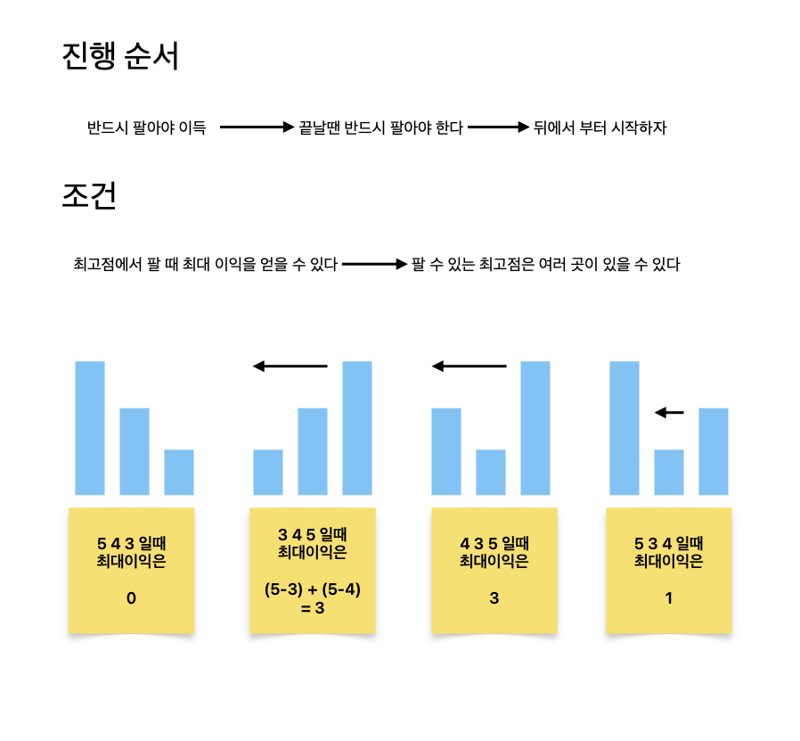

# 주식

[link](https://www.acmicpc.net/problem/11501)

홍준이는 요즘 주식에 빠져있다. 그는 미래를 내다보는 눈이 뛰어나, 날 별로 주가를 예상하고 언제나 그게 맞아떨어진다. 매일 그는 아래 세 가지 중 한 행동을 한다.

1. 주식 하나를 산다.
2. 원하는 만큼 가지고 있는 주식을 판다.
3. 아무것도 안한다.



```python
def get_max_profit(arr):
    result = 0
    curr = 0

    # 뒤에서부터 진행
    for i in range(len(arr) - 1, -1, -1):
        # 비교 대상군(arr[i])이 파는 날의 주식보다 비싸다면 갱신
        if arr[i] > curr:
            curr = arr[i]
        # 아니라면 주식 팔기
        else:
            result += curr - arr[i]

    return result


TC = int(input())
ans = []
for _ in range(TC):
    N = int(input())
    arr = list(map(int, input().split()))
    ans.append(get_max_profit(arr))

for val in ans:
    print(val)
```
