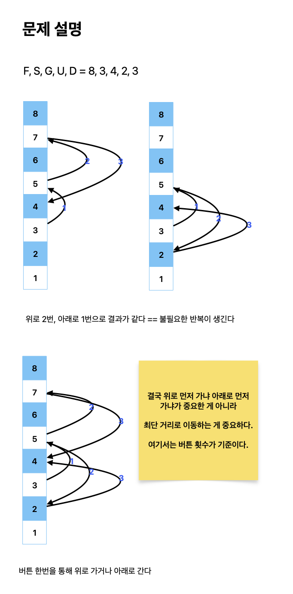

# 스타트링크

[link](https://www.acmicpc.net/problem/5014)

강호는 코딩 교육을 하는 스타트업 스타트링크에 지원했다. 오늘은 강호의 면접날이다. 하지만, 늦잠을 잔 강호는 스타트링크가 있는 건물에 늦게 도착하고 말았다.

스타트링크는 총 F층으로 이루어진 고층 건물에 사무실이 있고, 스타트링크가 있는 곳의 위치는 G층이다. 강호가 지금 있는 곳은 S층이고, 이제 엘리베이터를 타고 G층으로 이동하려고 한다.





```python
from collections import deque


def find_minimum_button_presses(F, S, G, U, D):
    queue = deque()
    visited = [False] * (F + 1)
    visited[S] = True
    queue.append((S, 0))

    while queue:
        floor, presses = queue.popleft()

        if floor == G:
            return presses

        next_floor_u = floor + U
        next_floor_d = floor - D

        if next_floor_u <= F and not visited[next_floor_u]:
            visited[next_floor_u] = True
            queue.append((next_floor_u, presses + 1))

        if next_floor_d >= 1 and not visited[next_floor_d]:
            visited[next_floor_d] = True
            queue.append((next_floor_d, presses + 1))

    return "use the stairs"


F, S, G, U, D = map(int, input().split())

result = find_minimum_button_presses(F, S, G, U, D)
print(result)
```
