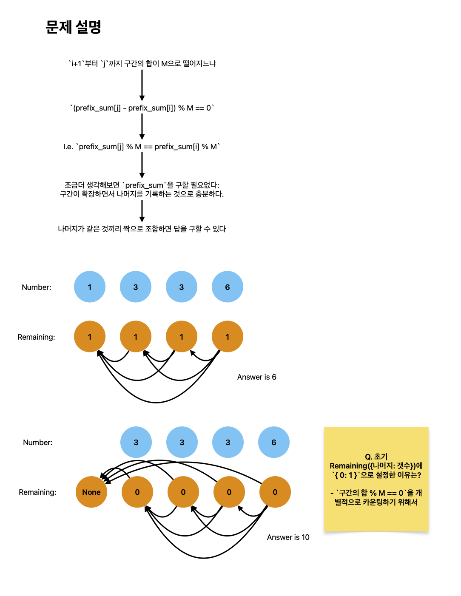

# 나머지 합

[link](https://www.acmicpc.net/problem/10986)

수 N개 A1, A2, ..., AN이 주어진다. 이때, 연속된 부분 구간의 합이 M으로 나누어 떨어지는 구간의 개수를 구하는 프로그램을 작성하시오.

즉, Ai + ... + Aj (i ≤ j) 의 합이 M으로 나누어 떨어지는 (i, j) 쌍의 개수를 구해야 한다.

## What I Learned

- `(prefix_sum[j] - prefix_sum[i]) % M == 0`이므로, 나머지가 같은 것끼리 짝을 구하면 된다.
- `remaining[0] += 1`을 초기에 설정한 이유는 `구간의 합 % M == 0`을 개별적으로 카운팅하기 위해서이다.



```python
from collections import defaultdict


def solve():
    N, M = map(int, input().split())
    nums = list(map(int, input().split()))
    remaining = defaultdict(int)
    remaining[0] += 1
    count = 0
    current_sum = 0

    for num in nums:
        current_sum = (current_sum + num) % M
        count += remaining[current_sum]
        remaining[current_sum] += 1

    print(count)


def solve_with_formula():
    N, M = map(int, input().split())
    nums = list(map(int, input().split()))
    remaining = defaultdict(int)
    remaining[0] += 1
    current_sum = 0

    for num in nums:
        current_sum = (current_sum + num) % M
        remaining[current_sum] += 1

    count = 0
    for key in remaining:
        # nC2
        count += remaining[key] * (remaining[key] - 1) // 2

    print(count)


solve()

```
