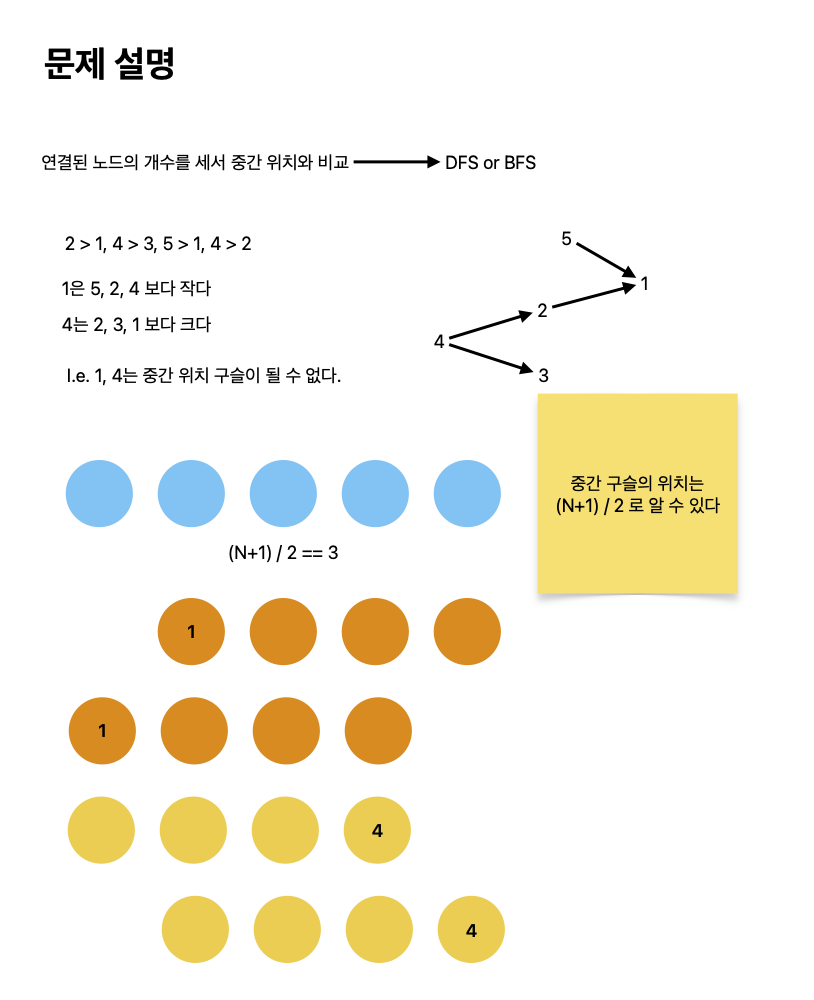

# 구슬 찾기

[link](https://www.acmicpc.net/problem/2617)

모양은 같으나, 무게가 모두 다른 N개의 구슬이 있다. N은 홀수이며, 구슬에는 번호가 1,2,...,N으로 붙어 있다. 이 구슬 중에서 무게가 전체의 중간인 (무게 순서로 (N+1)/2번째) 구슬을 찾기 위해서 아래와 같은 일을 하려 한다.

우리에게 주어진 것은 양팔 저울이다. 한 쌍의 구슬을 골라서 양팔 저울의 양쪽에 하나씩 올려 보면 어느 쪽이 무거운가를 알 수 있다. 이렇게 M개의 쌍을 골라서 각각 양팔 저울에 올려서 어느 것이 무거운가를 모두 알아냈다. 이 결과를 이용하여 무게가 중간이 될 가능성이 전혀 없는 구슬들은 먼저 제외한다.

## What I Learned

- 중간 구슬의 위치는 `(N + 1) / 2`으로 명시되어있다.
- 현재 구슬보다 무거운 또는 가벼운 구슬이 몇개인지 알면 구할 수 있으므로 `BFS` or `DFS`으로 풀 수 있다.



```python
from collections import defaultdict


def dfs(graph, node, visited):
    visited[node] = True
    count = 1
    for neighbor in graph[node]:
        if not visited[neighbor]:
            count += dfs(graph, neighbor, visited)
    return count


def solve():
    n, m = map(int, input().split())
    graph_up = defaultdict(list)
    graph_down = defaultdict(list)

    for _ in range(m):
        a, b = map(int, input().split())
        graph_up[a].append(b)
        graph_down[b].append(a)

    middleweight = 0
    for i in range(1, n + 1):
        visited_up = [False] * (n + 1)
        visited_down = [False] * (n + 1)
        up_count = dfs(graph_up, i, visited_up)
        down_count = dfs(graph_down, i, visited_down)

        if up_count > (n + 1) // 2 or down_count > (n + 1) // 2:
            middleweight += 1

    print(middleweight)


solve()
```
