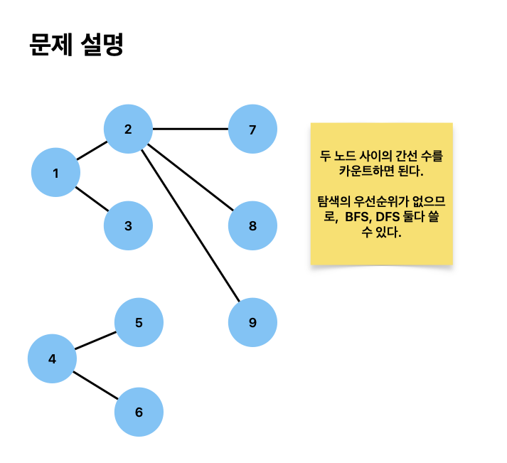

# 촌수 계산

[문제 링크](https://www.acmicpc.net/problem/2644)



```python
from collections import defaultdict, deque


def dfs(N, graph, src, dest):
    def search(curr):
        if curr == dest:
            return 0

        val = -1
        for adj in graph[curr]:
            if not visited[adj]:
                visited[adj] = True

                val = search(adj)
                if val != -1:
                    return val + 1

        return -1

    visited = [False] * (N + 1)
    visited[src] = True
    return search(src)


def bfs(N, graph, src, dest):
    queue = deque([(src, 0)])
    visited = [False] * (N + 1)
    visited[src] = True

    while queue:
        curr, count = queue.popleft()
        if curr == dest:
            return count

        for adj in graph[curr]:
            if not visited[adj]:
                visited[adj] = True
                queue.append((adj, count + 1))

    return -1


def solve():
    N = int(input())
    src, dest = map(int, input().split())
    PAIRS = int(input())
    graph = defaultdict(list)
    for _ in range(PAIRS):
        a, b = map(int, input().split())
        graph[a].append(b)
        graph[b].append(a)

    # ans = bfs(N, graph, src, dest)
    ans = dfs(N, graph, src, dest)
    print(ans)


solve()
```
