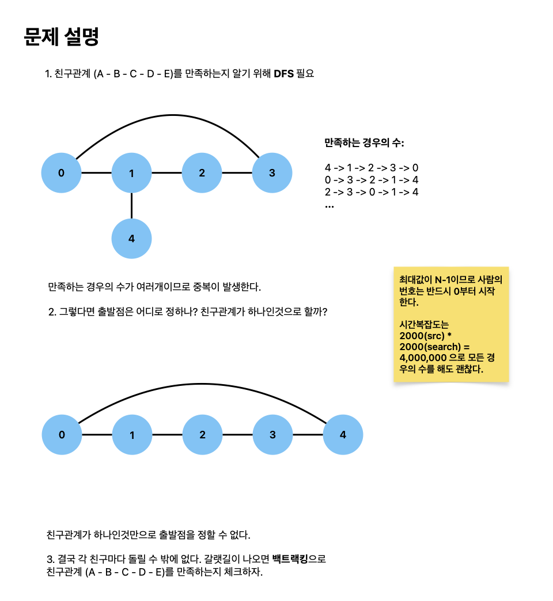

# ABCDE

[link](https://www.acmicpc.net/problem/13023)

BOJ 알고리즘 캠프에는 총 N명이 참가하고 있다. 사람들은 0번부터 N-1번으로 번호가 매겨져 있고, 일부 사람들은 친구이다.

오늘은 다음과 같은 친구 관계를 가진 사람 A, B, C, D, E가 존재하는지 구해보려고 한다.



```python
from collections import defaultdict


def dfs(graph, visited, src):
    def search(node, count):
        if count == 5:
            return True

        for adj in graph[node]:
            if not visited[adj]:
                visited[adj] = True
                if search(adj, count + 1):
                    return True
                visited[adj] = False
        return False

    count = 1
    visited[src] = True
    if search(src, count):
        return True

    visited[src] = False
    return False


def solve():
    N, M = map(int, input().split())

    graph = defaultdict(list)
    for _ in range(M):
        a, b = map(int, input().split())
        graph[a].append(b)
        graph[b].append(a)

    visited = [False] * N
    for i in range(N):
        if dfs(graph, visited, i):
            print(1)
            return

    print(0)


solve()

```
