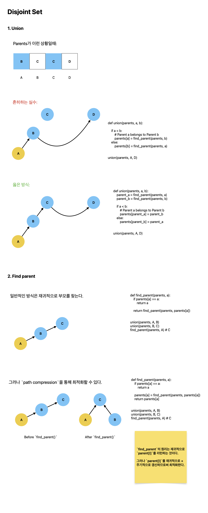

# 집합의 표현

[link](https://www.acmicpc.net/problem/1717)

초기에 $n+1$개의 집합 $\{0\}, \{1\}, \{2\}, \dots , \{n\}$이 있다. 여기에 합집합 연산과, 두 원소가 같은 집합에 포함되어 있는지를 확인하는 연산을 수행하려고 한다.

집합을 표현하는 프로그램을 작성하시오.



내가 배운 것:

- Disjoint Set
- `sys.stdin.readline`으로 시간 소요를 `4532ms` -> `308ms`로 단축

```python

import sys

sys.setrecursionlimit(10**6)
input = sys.stdin.readline

def union(parents, a, b):
    parent_a = find_parent(parents, a)
    parent_b = find_parent(parents, b)

    if a < b:
        # Parent a belongs to Parent b
        parents[parent_a] = parent_b
    else:
        parents[parent_b] = parent_a


def find_parent(parents, a):
    if parents[a] == a:
        return a

    parents[a] = find_parent(parents, parents[a])
    return parents[a]


def solve():
    N, M = map(int, input().split())
    COMMANDS = []
    for _ in range(M):
        COMMANDS.append(list(map(int, input().split())))

    parents = [i for i in range(N + 1)]
    for command in COMMANDS:
        num, a, b = command

        if num == 0:
            union(parents, a, b)
        else:
            # YES OR NO
            if find_parent(parents, a) == find_parent(parents, b):
                print("YES")
            else:
                print("NO")


solve()

```
