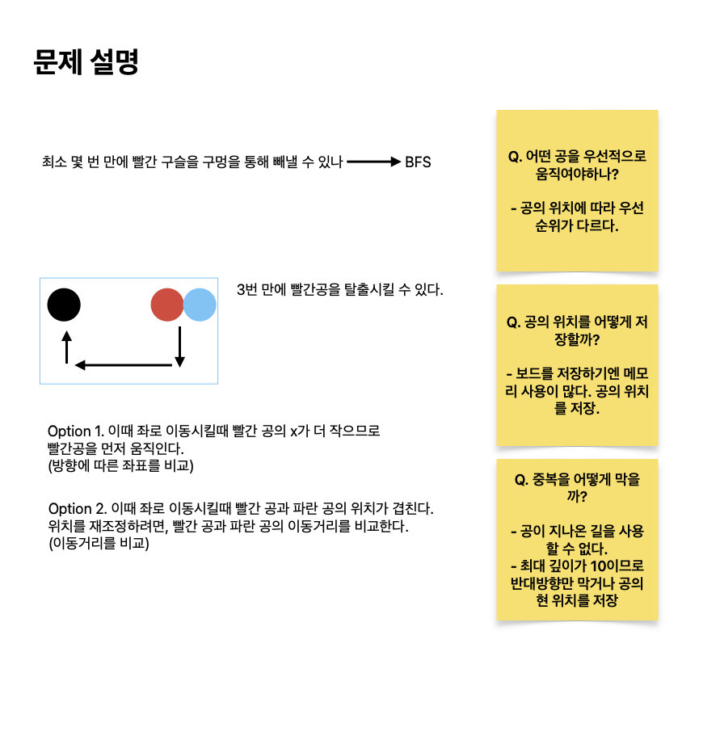

# 구슬 탈출 2

[link](https://www.acmicpc.net/problem/13460)

스타트링크에서 판매하는 어린이용 장난감 중에서 가장 인기가 많은 제품은 구슬 탈출이다. 구슬 탈출은 직사각형 보드에 빨간 구슬과 파란 구슬을 하나씩 넣은 다음, 빨간 구슬을 구멍을 통해 빼내는 게임이다.
...
보드의 상태가 주어졌을 때, 최소 몇 번 만에 빨간 구슬을 구멍을 통해 빼낼 수 있는지 구하는 프로그램을 작성하시오.



## What I learned

- 좌표로 바라봤을때 진행방향에 따라 고려해야할 요소가 상당히 많았다

첫번째 솔루션:

```python
from collections import deque
import sys

input = sys.stdin.readline


dy = [-1, 0, 0, 1]
dx = [0, -1, 1, 0]


def move(grid, direction, red, blue):
    def run(first, second):
        balls = []
        for ball in [first, second]:
            y, x = ball
            grid[y][x] = "b"  # ball
            ny, nx = y + dy[direction], x + dx[direction]
            # manage ny, nx, not y, x..
            while 1 <= ny < N - 1 and 1 <= nx < M - 1 and grid[ny][nx] == ".":
                grid[ny][nx] = grid[y][x]
                grid[y][x] = "."
                y, x = ny, nx
                ny, nx = ny + dy[direction], nx + dx[direction]

            # print("debug", direction, ball)
            # for row in grid: print(row)

            if grid[ny][nx] == "O":
                balls.append((ny, nx))
                y, x = ny - dy[direction], nx - dx[direction]
                grid[y][x] = "."
            else:
                y, x = ny - dy[direction], nx - dx[direction]
                balls.append((y, x))

        for y, x in balls:
            if grid[y][x] == "b":
                grid[y][x] = "."

        return balls

    N, M = len(grid), len(grid[0])

    first, second = None, None
    if direction == 0:
        if red[0] < blue[0]:
            first, second = red, blue
            new_red, new_blue = run(first, second)
            return (new_red, new_blue)
        else:
            first, second = blue, red
            new_blue, new_red = run(first, second)
            return (new_red, new_blue)
    elif direction == 1:
        if red[1] < blue[1]:
            first, second = red, blue
            new_red, new_blue = run(first, second)
            return (new_red, new_blue)
        else:
            first, second = blue, red
            new_blue, new_red = run(first, second)
            return (new_red, new_blue)
    elif direction == 2:
        if red[1] < blue[1]:
            first, second = blue, red
            new_blue, new_red = run(first, second)
            return (new_red, new_blue)
        else:
            first, second = red, blue
            new_red, new_blue = run(first, second)
            return (new_red, new_blue)
    elif direction == 3:
        if red[0] < blue[0]:
            first, second = blue, red
            new_blue, new_red = run(first, second)
            return (new_red, new_blue)
        else:
            first, second = red, blue
            new_red, new_blue = run(first, second)
            return (new_red, new_blue)


def bfs(grid, red, blue):
    queue = deque([(red, blue, 0, 4)])

    while queue:
        red, blue, count, direction = queue.popleft()
        if count == 10:
            continue

        for i in range(4):
            if i == 3 - direction:
                continue

            new_red, new_blue = move(grid, i, red, blue)
            if grid[new_blue[0]][new_blue[1]] == "O":
                continue
            elif grid[new_red[0]][new_red[1]] == "O":
                return count + 1

            queue.append((new_red, new_blue, count + 1, i))

    return -1


def solve():
    N, M = map(int, input().rstrip().split())

    red, blue = None, None
    grid = []
    for i in range(N):
        row = list(input().rstrip())
        grid.append(row)
        for j in range(M):
            if row[j] == "R":
                red = (i, j)
                grid[i][j] = "."
            elif row[j] == "B":
                blue = (i, j)
                grid[i][j] = "."

    return bfs(grid, red, blue)


ans = solve()
print(ans)
```

두번째 솔루션:

```python
from collections import deque

# Directions: up, down, left, right
dx = [-1, 1, 0, 0]
dy = [0, 0, -1, 1]

# Function to move the marble until it hits an obstacle or goes out of bounds
def move(x, y, dx, dy):
    count = 0
    while board[x+dx][y+dy] != '#' and board[x][y] != 'O':
        x += dx
        y += dy
        count += 1
    return x, y, count

# Function to perform the breadth-first search
def bfs(rx, ry, bx, by):
    queue = deque([(rx, ry, bx, by, 0)])
    visited = set([(rx, ry, bx, by)])

    while queue:
        rx, ry, bx, by, depth = queue.popleft()

        if depth == 10:
            break

        for i in range(4):
            nrx, nry, rc = move(rx, ry, dx[i], dy[i])
            nbx, nby, bc = move(bx, by, dx[i], dy[i])

            if board[nbx][nby] == 'O':
                continue

            if board[nrx][nry] == 'O':
                return depth + 1

            if nrx == nbx and nry == nby:
                if rc > bc:
                    nrx -= dx[i]
                    nry -= dy[i]
                else:
                    nbx -= dx[i]
                    nby -= dy[i]

            if (nrx, nry, nbx, nby) not in visited:
                visited.add((nrx, nry, nbx, nby))
                queue.append((nrx, nry, nbx, nby, depth + 1))

    return -1

# Read the input
N, M = map(int, input().split())
board = [list(input()) for _ in range(N)]

rx, ry, bx, by = 0, 0, 0, 0

# Find the initial positions of the marbles
for i in range(N):
    for j in range(M):
        if board[i][j] == 'R':
            rx, ry = i, j
            board[i][j] = '.'
        elif board[i][j] == 'B':
            bx, by = i, j
            board[i][j] = '.'

# Perform the breadth-first search and print the result
print(bfs(rx, ry, bx, by))
```
