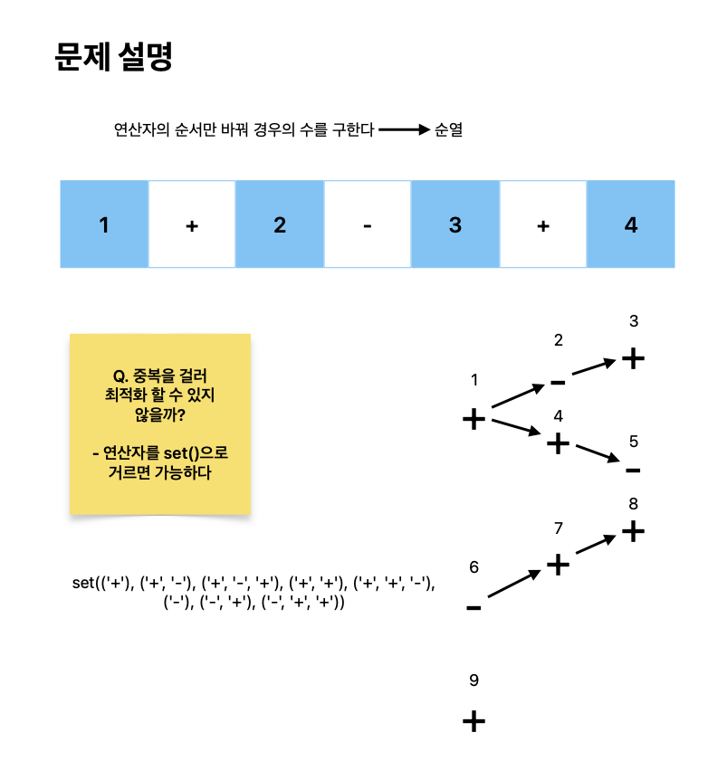

# 연산자 끼워넣기

[link](https://www.acmicpc.net/problem/14888)

N개의 수로 이루어진 수열 A1, A2, ..., AN이 주어진다. 또, 수와 수 사이에 끼워넣을 수 있는 N-1개의 연산자가 주어진다. 연산자는 덧셈(+), 뺄셈(-), 곱셈(×), 나눗셈(÷)으로만 이루어져 있다.

우리는 수와 수 사이에 연산자를 하나씩 넣어서, 수식을 하나 만들 수 있다. 이때, 주어진 수의 순서를 바꾸면 안 된다.

예를 들어, 6개의 수로 이루어진 수열이 1, 2, 3, 4, 5, 6이고, 주어진 연산자가 덧셈(+) 2개, 뺄셈(-) 1개, 곱셈(×) 1개, 나눗셈(÷) 1개인 경우에는 총 60가지의 식을 만들 수 있다. 예를 들어, 아래와 같은 식을 만들 수 있다.

## What I learned

- 처음에 주어진 인풋 형태로 푸려다 시간이 너무 오래걸렸다. 알고리즘은 빠르고 정확하게 푸는 것이 중요하므로 익숙한 형태로 바꿔 푸는 게 좋다.
- `set()`을 사용해 중복을 걸렀다. 이는 `1196ms` 에서 `252ms`로 줄이는데 기여했다.
- 시간 복잡도는 `10! = 3_628_800`로 단순히 순열로 풀어도 문제 없지만 때로는 python3 자체가 느려서 시간 초과가 걸릴 수 있다. 만약 더이상 최적화가 불가능하다면 pypy3로 바꿔서 돌려보자.



```python
import sys


def solve():
    def calc(ops):
        # print(ops)
        result = numbers[0]
        for idx, op in enumerate(ops):
            if op == "+":
                result = result + numbers[idx + 1]
            elif op == "-":
                result = result - numbers[idx + 1]
            elif op == "*":
                result = result * numbers[idx + 1]
            else:
                result = int(result / numbers[idx + 1])
        return result

    def permutation(visited, op_set, ops):
        if N - 1 == len(ops):
            val = calc(ops)
            return [val, val]

        min_val, max_val = sys.maxsize, -sys.maxsize
        for i in range(len(operators)):
            new_ops = (*ops, operators[i])
            if new_ops in op_set or visited[i]:
                continue

            op_set.add(new_ops)
            visited[i] = True
            min_calc_val, max_calc_val = permutation(visited, op_set, new_ops)
            min_val = min(min_val, min_calc_val)
            max_val = max(max_val, max_calc_val)
            visited[i] = False
        return [min_val, max_val]

    N = int(input())
    numbers = list(map(int, input().split()))
    operators_input = list(map(int, input().split()))

    operators = []
    for i in range(len(operators_input)):
        for j in range(operators_input[i]):
            if i == 0:
                operators.append("+")
            elif i == 1:
                operators.append("-")
            elif i == 2:
                operators.append("*")
            else:
                operators.append("/")

    # print("op: ", operators)
    visited = [False] * len(operators)
    op_set = set()
    min_val, max_val = permutation(visited, op_set, tuple())

    return [min_val, max_val]


min_val, max_val = solve()
print(max_val)
print(min_val)
```
