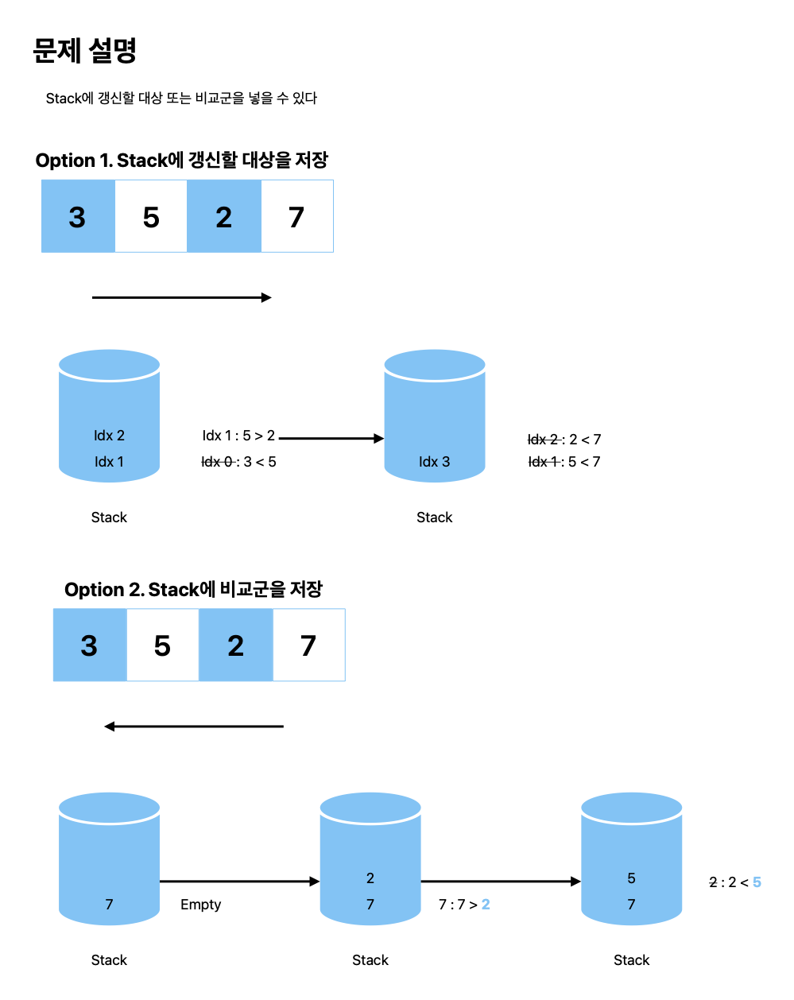

# 오큰수

[link](https://www.acmicpc.net/problem/17298)

## What I learned

- 시간 복잡도는 `O(2N)`: 전체 탐색 `O(N)` + 스택이 `while`문에서 사용되는 빈도 수 `O(N)`.
- Stack에 어떤 데이터를 넣느냐에 따라 앞에서 또는 뒤에서 탐색할 수 있다: 갱신할 대상이냐 혹은 비교군이냐



First Try:

- Stack에 값을 쌓아 순서대로 비교하기 위해 뒤에서부터 탐색을 시작했다

```python
def solve():
    N = int(input())
    data = list(map(int, input().split()))

    ans = []
    stack = []
    for i in range(N - 1, -1, -1):
        if not stack:
            ans.append(-1)
        else:
            while stack and data[i] >= stack[-1]:
                stack.pop()
            if stack:
                ans.append(stack[-1])
            else:
                ans.append(-1)
        stack.append(data[i])

    return ans[::-1]


answer = solve()
print(" ".join(map(str, answer)))
```

Second Try:

- 앞에서부터 탐색을 시작하는 것도 가능하다. Stack에 아직 처리되지 않은 값의 인덱스를 저장한다면 (첫 시도의 코드와 똑같이) `while`문이 `O(N)`으로 처리 가능하다.

```python
def solve():
    N = int(input())
    data = list(map(int, input().split()))

    ans = [-1] * N
    stack = []

    for i in range(N):
        while stack and data[stack[-1]] < data[i]:
            ans[stack.pop()] = data[i]
        stack.append(i)

    return ans


answer = solve()
print(" ".join(map(str, answer)))
```
