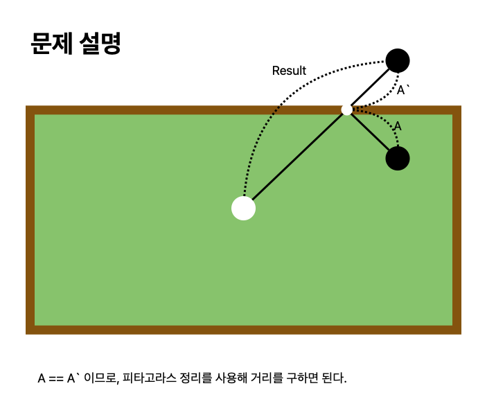

# 당구 연습

[link](https://school.programmers.co.kr/learn/courses/30/lessons/169198)

당구대의 가로 길이 m, 세로 길이 n과 머쓱이가 쳐야 하는 공이 놓인 위치 좌표를 나타내는 두 정수 startX, startY, 그리고 매 회마다 목표로 해야하는 공들의 위치 좌표를 나타내는 정수 쌍들이 들어있는 2차원 정수배열 balls가 주어집니다.

"원쿠션" 연습을 위해 머쓱이가 공을 적어도 벽에 한 번은 맞춘 후 목표 공에 맞힌다고 할 때, 각 회마다 머쓱이가 친 공이 굴러간 거리의 최솟값의 제곱을 배열에 담아 return 하도록 solution 함수를 완성해 주세요.

## What I learned

- 수학적 개념을 코드로 변환할 수 있는지 묻는 문제였다.
- 내가 헤맸던 부분은 x축이 같을때 상단 또는 하단을 원쿠션해야함을 인지하지 못했다.



```python
def solution(m, n, startX, startY, balls):
    answer = []
    for x, y in balls:
        ans = -1
        left = (startX + x) ** 2 + (startY - y) ** 2
        right = (m + (m - x) - startX) ** 2 + (startY - y) ** 2
        top = (x - startX) ** 2 + (n - startY + n - y) ** 2
        bottom = (x - startX) ** 2 + (startY + y) ** 2
        if startX == x:
            if startY > y:
                ans = min(top, left, right)
            else:
                ans = min(bottom, left, right)
        elif startY == y:
            if startX > x:
                ans = min(right, top, bottom)
            else:
                ans = min(left, top, bottom)
        else:
            ans = min(top, bottom, left, right)
        answer.append(ans)

    return answer

```
