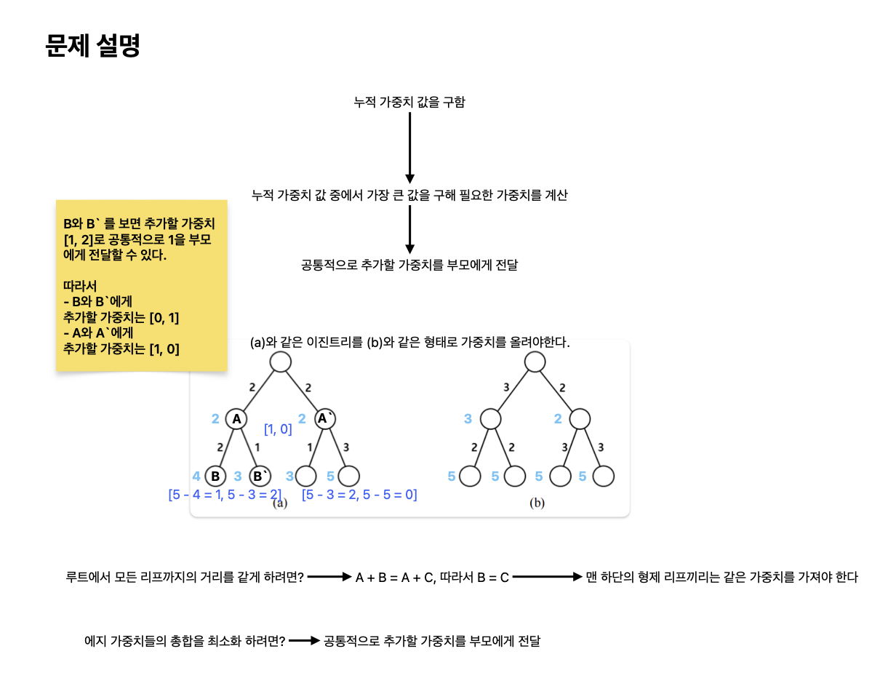

# 이진 트리

[link](https://www.acmicpc.net/problem/13325)
각 에지에 양수인 가중치가 부여된 높이가 k인 포화이진트리가 주어져 있다. 높이 k인 포화이진트리는 2k개의 리프를 포함하여 (2k+1 − 1)개의 노드를 가진다. 루트에서 어떤 리프까지의 거리는 루트에서 그 리프까지의 경로상에 있는 모든 에지들의 가중치를 더한 값이다. 이 문제에서는, 어떤 에지들의 가중치를 증가시켜서 루트에서 모든 리프까지의 거리가 같도록 하고, 또한 에지 가중치들의 총합을 최소화 하려고 한다.

포화이진트리에 들어 있는 모든 에지들의 가중치가 주어졌을 때, 어떤 에지들의 가중치를 증가시켜서 루트에서 모든 리프까지의 거리가 같게 하면서 에지 가중치들의 총합이 최소가 되도록 하는 프로그램을 작성하시오.

## What I learned

- DFS를 이용하여 재귀로 트리를 후위 순회해주면 자료구조의 개념을 그대로 사용할 수 있어 더 명료해진다. [[BOJ] 백준 13325번 이진 트리 (Java)](https://loosie.tistory.com/690), [[Python] 백준 13325번: 이진 트리](https://lcyking.tistory.com/m/62)



```python
def solve():
    def search(level, at):
        to = at + 2**level
        remainders = None
        if level == N:
            max_val = max(total_sum[at:to])
            remainders = [max_val - total_sum[i] for i in range(at, to)]
        else:
            remainders = search(level + 1, to)

        # print("remainder: ", remainders)
        result = []
        for i in range(0, len(remainders), 2):
            if remainders[i] > 0 and remainders[i + 1] > 0:
                parent = min(remainders[i], remainders[i + 1])
                result.append(parent)
                data[at + i] += remainders[i] - parent
                data[at + i + 1] += remainders[i + 1] - parent
            else:
                result.append(0)
                data[at + i] += remainders[i]
                data[at + i + 1] += remainders[i + 1]

        return result

    N = int(input())
    data = list(map(int, input().split()))

    total_sum = []
    parent = -1
    for i in range(0, len(data), 2):
        if parent == -1:
            total_sum.append(data[i])
            total_sum.append(data[i + 1])
        else:
            total_sum.append(data[i] + total_sum[parent])
            total_sum.append(data[i + 1] + total_sum[parent])
        parent += 1

    parent = search(1, 0)
    # print("data: ", data)
    return sum(data) + sum(parent)


print(solve())

```
