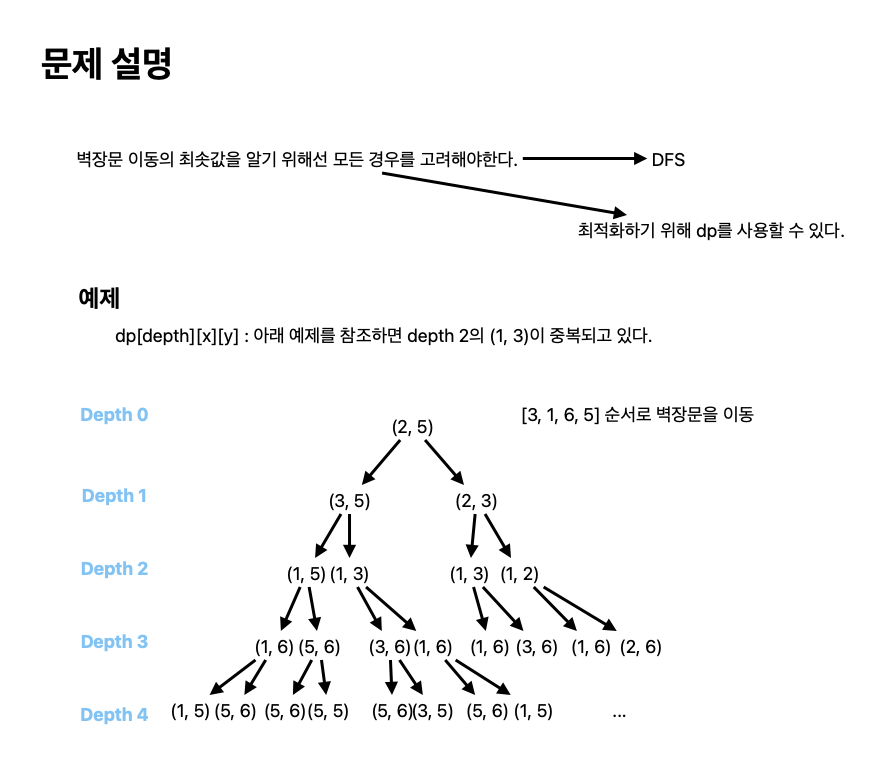

# 벽장문의 이동

[link](https://www.acmicpc.net/problem/2666)

n개의 같은 크기의 벽장들이 일렬로 붙어져 있고 벽장의 문은 n-2개만이 있다. 한 벽장 앞에 있는 문은 이웃 벽장 앞에 문이 없다면(즉, 벽장이 열려있다면) 그 벽장 앞으로 움직일 수 있다.

그림은 7개의 벽장의 예이다. 그림에서 2번 벽장과 5번 벽장이 열려있고, 나머지 벽장은 닫혀 있다. 벽장 문은 좌우 어느 쪽이든 그 이웃 벽장이 열려 있다면 그 쪽으로 한 칸씩 이동할 수 있다. 그림에서 주어진 상태에서는 1번 벽장을 닫고 있는 벽장문을 오른쪽으로 한 칸 이동함으로써 1번 벽장을 사용할 수 있다. 이때 2번 벽장은 닫혀져 사용할 수 없다. 역시 5번 벽장이 열려 있으므로 4번 벽장 또는 6번 벽장 앞의 벽장문을 5번 벽장 앞으로 이동시킬 수 있다.

## What I learned

- `dfs`로 문제를 풀었다. 시간 복잡도는 `1 + 2 + 4 + ... + 2^19 == 2^20 - 1` 이므로 충분히 만족한다.
- 벽장문의 크기에 따라 `if문`으로 분기 처리하면 `524ms`를 `44ms`으로 줄일 수 있다.
- `dp`로 풀 수도 있는 문제다.



```python
import sys

input = sys.stdin.readline


def solve():
    N = int(input().rstrip())
    x, y = map(int, input().rstrip().split())
    length = int(input().rstrip())
    orders = [int(input().rstrip()) for _ in range(length)]

    if x > y:
        x, y = y, x

    return get_result(orders, 0, x, y)


def get_result(orders, idx, x, y):
    if idx == len(orders):
        return 0

    # 524 ms
    val1 = abs(orders[idx] - x) + get_result(orders, idx + 1, orders[idx], y)
    val2 = abs(orders[idx] - y) + get_result(orders, idx + 1, x, orders[idx])
    min_val = min(val1, val2)

    '''
    # 44 ms
    min_val = float("inf")
    if orders[idx] <= x < y:
        val = abs(orders[idx] - x) + get_result(orders, idx + 1, orders[idx], y)
        min_val = min(min_val, val)
    elif x < orders[idx] < y:
        val1 = abs(orders[idx] - x) + get_result(orders, idx + 1, orders[idx], y)
        val2 = abs(orders[idx] - y) + get_result(orders, idx + 1, x, orders[idx])
        min_val = min(min_val, val1, val2)
    else:
        val = abs(orders[idx] - y) + get_result(orders, idx + 1, x, orders[idx])
        min_val = min(min_val, val)
    '''

    return min_val


ans = solve()
print(ans)

```

DP

```python
def solve(idx, open1, open2):
    if idx == M:
        return 0

    if dp[idx][open1][open2] != -1:
        return dp[idx][open1][open2]

    open1_cnt = solve(idx + 1, order[idx], open2) + abs(order[idx] - open1)
    open2_cnt = solve(idx + 1, open1, order[idx]) + abs(order[idx] - open2)

    dp[idx][open1][open2] = min(open1_cnt, open2_cnt)
    return dp[idx][open1][open2]

N = int(input())
open1, open2 = map(int, input().split())
order = []
M = int(input())
for _ in range(M):
    order.append(int(input()))

dp = [[[-1] * (N + 1) for _ in range(N + 1)] for _ in range(M)]
print(solve(0, open1, open2))

```
