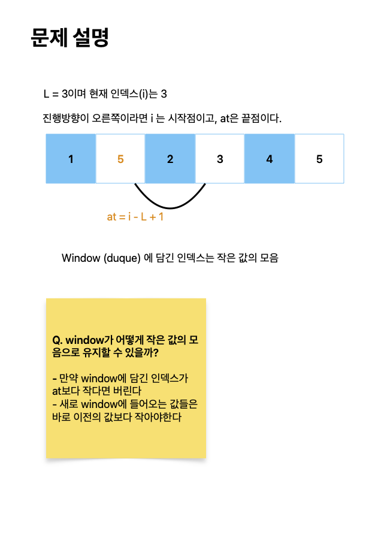

# 최솟값 찾기

[link](https://www.acmicpc.net/problem/11003)

N개의 수 A1, A2, ..., AN과 L이 주어진다.

Di = Ai-L+1 ~ Ai 중의 최솟값이라고 할 때, D에 저장된 수를 출력하는 프로그램을 작성하시오. 이때, i ≤ 0 인 Ai는 무시하고 D를 구해야 한다.



```python
from collections import deque


def solve():
    N, L = map(int, input().split())
    data = list(map(int, input().split()))
    answer = []

    window = deque()
    for i in range(N):
        at = i - L + 1
        if window and window[0] < at:
            window.popleft()

        while window and data[window[-1]] >= data[i]:
            window.pop()
        window.append(i)

        answer.append(data[window[0]])

    return answer


ans = solve()
print(" ".join(map(str, ans)))
```
