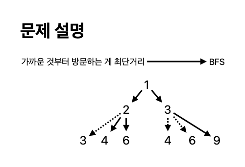

# 1로 만들기

[link](https://www.acmicpc.net/problem/1463)

정수 X에 사용할 수 있는 연산은 다음과 같이 세 가지 이다.

X가 3으로 나누어 떨어지면, 3으로 나눈다.
X가 2로 나누어 떨어지면, 2로 나눈다.
1을 뺀다.
정수 N이 주어졌을 때, 위와 같은 연산 세 개를 적절히 사용해서 1을 만들려고 한다. 연산을 사용하는 횟수의 최솟값을 출력하시오.



```python
from collections import deque


def bfs():
    N = int(input())
    dp = [-1] * (N + 1)
    dp[1] = 0

    queue = deque([1])

    while queue:
        curr = queue.popleft()
        if curr == N:
            return dp[N]

        for val in [curr + 1, curr * 2, curr * 3]:
            if val <= N and dp[val] == -1:
                dp[val] = dp[curr] + 1
                queue.append(val)

    return dp[N]


ans = bfs()
print(ans)

```
