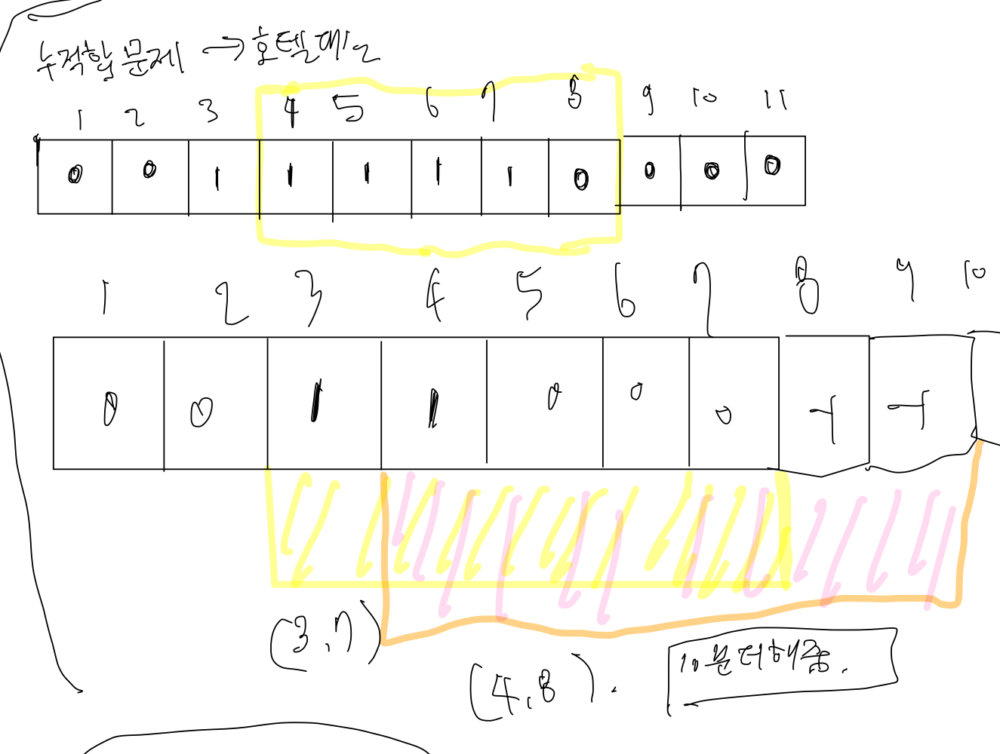

# 호텔 대실
[link](https://school.programmers.co.kr/learn/courses/30/lessons/161989)



## 문제 풀이
1. 들어오는 시간을 단위로 정렬해서 일렬로 나열함. 오름차순 정렬
2. 객실에 대한 정보 두개를 각각 넣어주어 시간을 구해줌.
3. 들어온 값과 비교하여 퇴실시간이 들어온 시간보다 나중이라면 대체해줌 이러한 컨셉으로 나가고 들어오는 것을 구할 수 있음. 최후에 남아있는 방이 우리가 가져야할 방의 개수이다.
````````
import java.util.*;
class Solution {
    
    public int solution(String[][] book_time) {
        Arrays.sort(book_time, new Comparator<String[]>(){
            
            @Override
            public int compare(String[] o1, String[] o2) {
                if(o1[0].equals(o2[0]))
                    return o1[1].compareTo(o2[1]);
                else 
                    return o1[0].compareTo(o2[0]); //애초에 일렬로 쭉 세움 시간별로 그 후에, 정렬해서 품.
            }
        });
        
        int[][] time = new int[book_time.length][2];
        for(int i=0; i < book_time.length; i++){
            int start_time = Integer.parseInt(book_time[i][0].replace(":", ""));
            int end_time = Integer.parseInt(book_time[i][1].replace(":",""));
            
            end_time += 10;
            if(end_time%100 >= 60) {
                end_time+=40;
            }
            
            time[i][0] = start_time;
            time[i][1] = end_time;
        }
        
        ArrayList<Integer> rooms = new ArrayList<>();
        for(int i=0; i < time.length; i++){
            boolean isAdd = false; // 객실이 할당되었는가?
            for(int j=0; j<rooms.size(); j++){
                if(time[i][0] >= rooms.get(j)){
                    rooms.set(j, time[i][1]);
                    isAdd = true;
                    break;   
                }
            }
            
            if(!isAdd) {
                rooms.add(time[i][1]);
            }
        }
        return rooms.size();
    }
}
````````


## 누적합으로 푼 문제 풀이.
``````
import java.util.*;
class Solution {

    private static final int MAX_TIME = 1450;
    private static final int HOUR = 60;
    private static final int CLEAN_TIME = 10;
    
    public int solution(String[][] book_time) {
        int answer = 0;
        
        int rooms[] = new int[MAX_TIME];
        
        for(String[] time: book_time){
            String inTime = time[0];
            String outTime = time[1];
            
            rooms[calculateTime(inTime)] += 1;
            
            
            rooms[calculateTime(outTime) + CLEAN_TIME] -= 1;   
        }
        
        for(int i= 1; i < MAX_TIME; i++){
            rooms[i] += rooms[i-1];
            answer = Math.max(answer, rooms[i]);
        }
        
        return answer;
    }
    public static int calculateTime(String time){
        String []seperate = time.split(":");
        String hour = seperate[0];
        String minute = seperate[1];
        
        return ((Integer.parseInt(hour) * HOUR) + Integer.parseInt(minute));
    }
}
``````