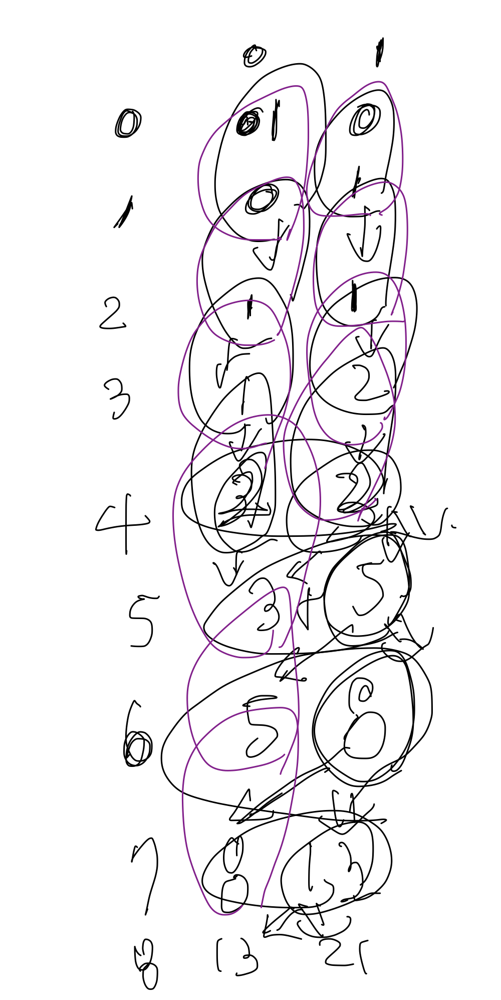

# 백준 1003 피보나치 함수 - Java[자바] 
## [link](https://www.acmicpc.net/problem/1003)


# 문제 풀이
N=2 일 때, Fibonacci(2) = Fibonacci(1) + Fibonacci(0) 이므로, 0과 1은 한번 씩 호출된다. <br>
N=3 일 때, Fibonacci(3) = Fibonacci(2) => (Fibonacci(1) + Fibonacci(0)) + Fibonacci(1) <br>
0은 1번 1은 2번 호출 

N=30이여도 0과 1호출 횟수 구하면 하위 단계에서 0과 1을 찾기 위한 재귀함수가 자연스럽게 호출된다. 

N이 최대 40까지 주어진다. 배열 두개를 선언해주어 각가 0과 1을 담아준다. 



```
package src.Week13.Baekjoon1003;

import java.io.BufferedReader;
import java.io.IOException;
import java.io.InputStreamReader;
import java.util.Scanner;

public class Baekjoon1003 {

    static Integer[][] dp = new Integer[41][2];
    public static void main(String[] args)  throws IOException {
        BufferedReader br = new BufferedReader(new InputStreamReader(System.in));

        dp[0][0] = 1;
        dp[0][1] = 0;
        dp[1][0] = 0;
        dp[1][1] = 1;

        int T = Integer.parseInt(br.readLine());

        StringBuilder sb = new StringBuilder();
        while(T-- > 0){
            int N = Integer.parseInt(br.readLine());
            fibonacci(N);
            sb.append(dp[N][0] + " " + dp[N][1]).append('\n');
        }

        System.out.println(sb);
    }

    static Integer[] fibonacci(int N) {
        if(dp[N][0] == null || dp[N][1] == null) { // 메모제이션
            dp[N][0] = fibonacci(N - 1)[0] + fibonacci(N - 2)[0];
            dp[N][1] = fibonacci(N - 1)[1] + fibonacci( N - 2)[1];
        }
        return dp[N];
    }
}

```