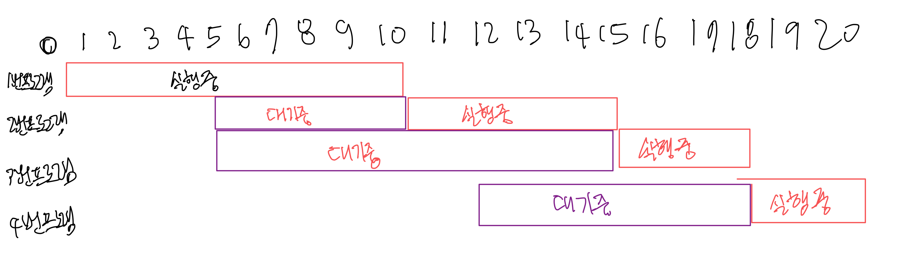

## [PCCP 모의고사 #1] 4번 - 운영체제
## [link](https://school.programmers.co.kr/learn/courses/15008/lessons/121686)


## 문제 풀이
1. 우선순위 큐 두개를 만듬.
2. wait 큐에는 전부다 넣어줌 호출되지 않은 것들
3. arrive 큐는 호출되었지만 아직 진행중인 것들이 들어감
4. wait, arrive큐가 모두 비었을 때, 종료됨
5. 현재 시각 기준으로 작업이 있으면 arrive큐에 넣어준다. 이때 , arrive큐는 우선순위로 정렬되기 때문에 우선순위로 뽑아서 쓸 수 있음.
6. arrive 큐에 다음 진행할 작업이 있으면 그 작업에 대해 answer에는 대기시간을 더해주고, 시간에는 이 작업의 진행 시간만큼 더해준다. 
7. 아직 호출되지 않은 큐가 있다면 가장 빠른 시간을 호출할 수있도록 바꿔줌


<br/>

````
import java.util.*;

class Solution { 
    
    public long[] solution(int[][] program) {
        long[] answer = new long[11];
        Queue<int[]> wait = new PriorityQueue<>((a,b)-> a[1] -b[1]);
        Queue<int[]> arrive = new PriorityQueue<>((a,b)-> {
            if(a[0]==b[0]) return a[1]-b[1];
            else return a[0]-b[0];
        });
        
        long time = 0;
        for(int[] p : program){
            wait.add(p);
        }
        
        while(!wait.isEmpty() || !arrive.isEmpty()){
            if(!wait.isEmpty()&& time >= wait.peek()[1]){
                while(!wait.isEmpty()&&time>=wait.peek()[1]){
                    arrive.add(wait.poll());                
                }
            }
            
            if(!arrive.isEmpty()){
                answer[arrive.peek()[0]] += time - arrive.peek()[1];
                time+=arrive.poll()[2];
            } else if(!wait.isEmpty()) time=wait.peek()[1];
        }
        answer[0]=time;
        return answer;
    }
}
````