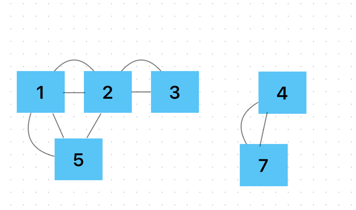

# 바이러스 
- - -

# 문제
- - -
신종 바이러스인 웜 바이러스는 네트워크를 통해 전파된다. 한 컴퓨터가 웜 바이러스에 걸리면 그 컴퓨터와 네트워크 상에서 연결되어 있는 모든 컴퓨터는 웜 바이러스에 걸리게 된다.
예를 들어 7대의 컴퓨터가 <그림 1>과 같이 네트워크 상에서 연결되어 있다고 하자. 1번 컴퓨터가 웜 바이러스에 걸리면 웜 바이러스는 2번과 5번 컴퓨터를 거쳐 3번과 6번 컴퓨터까지 전파되어 2, 3, 5, 6 네 대의 컴퓨터는 웜 바이러스에 걸리게 된다. 하지만 4번과 7번 컴퓨터는 1번 컴퓨터와 네트워크상에서 연결되어 있지 않기 때문에 영향을 받지 않는다.




1. 그림처럼 간선으로 연결된 인접한 노드로 바이러스를 전파 시킬 수 있다.
2. 인접한 노드로 바이러스를 전파시키면 전파시킨 노드도 인접 노드로 바이러스를 전파시킬 수 있다.
3. 양방향으로 서로 왔다갔다 할 수 있음 
4. 방문 체크로직을 통해서 걸러줘야함. 

- - -

``````
package src.Week2.Baekjoon2606;

import java.io.BufferedReader;
import java.io.IOException;
import java.io.InputStreamReader;
import java.util.*;

/**
 *
 */
public class Main {
    static int n,rn;
    static boolean virusCheck[];
    static int[][] arr;
    static int count =0;
    public static void main(String[] args) throws IOException {
        BufferedReader br = new BufferedReader(new InputStreamReader(System.in));
        n = Integer.parseInt(br.readLine());
        rn = Integer.parseInt(br.readLine());
        arr = new int[n+1][n+1];
        virusCheck = new boolean[n+1];

        StringTokenizer st;

        for(int i=1;i<=rn;i++){
            st = new StringTokenizer(br.readLine());

            int num1 = Integer.parseInt(st.nextToken());
            int num2 = Integer.parseInt(st.nextToken());
            arr[num1][num2] = arr[num2][num1] = 1; // 양 방향
        }
        dfs(1);
        System.out.println(count - 1);
    }

    public static void dfs(int start){
        virusCheck[start]=true;
        count++;

        for(int i=1;i<=n;i++){
            if(arr[start][i]==1 && !virusCheck[i]) dfs(i);
        }
    }
}
``````