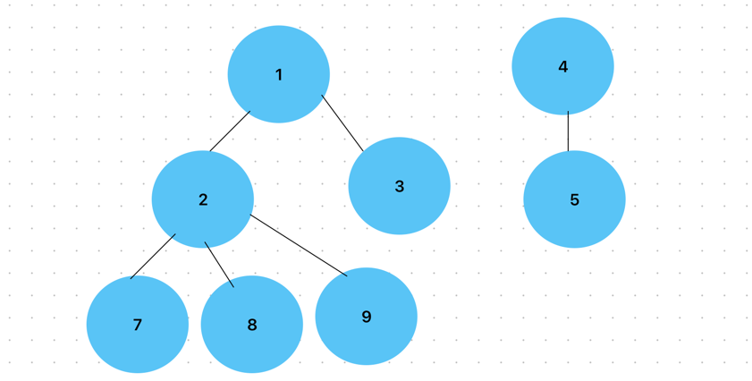

# 촌수계산 2644
- - -
## 문제
우리 나라는 가족 혹은 친척들 사이의 관계를 촌수라는 단위로 표현하는 독특한 문화를 가지고 있다. 이러한 촌수는 다음과 같은 방식으로 계산된다. 기본적으로 부모와 자식 사이를 1촌으로 정의하고 이로부터 사람들 간의 촌수를 계산한다. 예를 들면 나와 아버지, 아버지와 할아버지는 각각 1촌으로 나와 할아버지는 2촌이 되고, 아버지 형제들과 할아버지는 1촌, 나와 아버지 형제들과는 3촌이 된다.

여러 사람들에 대한 부모 자식들 간의 관계가 주어졌을 때, 주어진 두 사람의 촌수를 계산하는 프로그램을 작성하시오.


입력
- - -
사람들은 1, 2, 3, …, n (1 ≤ n ≤ 100)의 연속된 번호로 각각 표시된다. 입력 파일의 첫째 줄에는 전체 사람의 수 n이 주어지고, 둘째 줄에는 촌수를 계산해야 하는 서로 다른 두 사람의 번호가 주어진다. 그리고 셋째 줄에는 부모 자식들 간의 관계의 개수 m이 주어진다. 넷째 줄부터는 부모 자식간의 관계를 나타내는 두 번호 x,y가 각 줄에 나온다. 이때 앞에 나오는 번호 x는 뒤에 나오는 정수 y의 부모 번호를 나타낸다.

각 사람의 부모는 최대 한 명만 주어진다.

출력
- - -
입력에서 요구한 두 사람의 촌수를 나타내는 정수를 출력한다. 어떤 경우에는 두 사람의 친척 관계가 전혀 없어 촌수를 계산할 수 없을 때가 있다. 이때에는 -1을 출력해야 한다.


# 문제 풀이


1. 그래프가 연결되어 있지 않다면 -1 , 그래프가 연결되어있다면 촌수를 구해준다.
2. 관계를 타고가면서 목표 도달 노드까지 촌수를 카운트해준다.

- - -
``````
package src.Week2.Baekjoon2644;

import java.io.BufferedReader;
import java.io.IOException;
import java.io.InputStreamReader;
import java.util.LinkedList;
import java.util.Queue;
import java.util.StringTokenizer;

/**
 *
 */
public class Main {
    static int N, start, goal, rN;
    static int graph[][];
    static int dist[];
    static boolean check[];
    static int count = 0;
    public static void main(String[] args) throws IOException {
        BufferedReader br = new BufferedReader(new InputStreamReader(System.in));

        N = Integer.parseInt(br.readLine());
        graph = new int[N+1][N+1];
        check = new boolean[N+1];
        StringTokenizer st = new StringTokenizer(br.readLine());

        start = Integer.parseInt(st.nextToken());
        goal = Integer.parseInt(st.nextToken());

        rN = Integer.parseInt(br.readLine());
        for(int i=0; i<rN; i++){
                st = new StringTokenizer(br.readLine());
                int num1 = Integer.parseInt(st.nextToken());
                int num2 = Integer.parseInt(st.nextToken());
                graph[num1][num2] = graph[num2][num1] = 1;
        }
        dfs(start, 0);
        System.out.println(count==0? -1 : count);


    }

    static void dfs(int i, int d){
        if(i==goal) {
            count = d;
            return;
        }
        check[i]=true;

        for(int j= 1; j<=N; j++){
            if(graph[i][j]==1 && !check[j]){
                dfs(j, d+1);
            }
        }
    }

    static void bfs(int i){
        Queue<Integer> q = new LinkedList<>();
        q.add(i);
        check[i] = true;
        while(!q.isEmpty()){
            int target = q.poll();
            for(int j=1; j<=N; j++){
                if(graph[target][j]==1&& !check[j]){
                    q.add(j);
                    dist[i] = dist[target] + 1;
                }
            }
        }
    }

}

``````