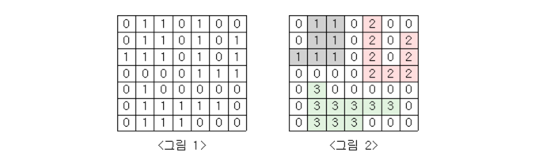
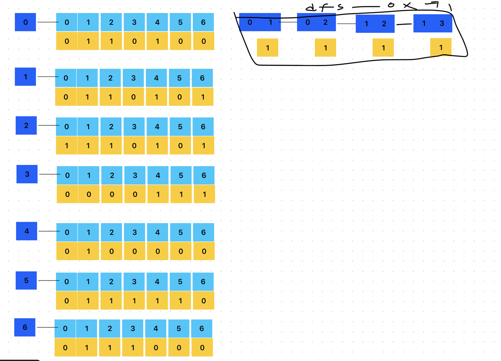

# 단지번호붙이기

<그림 1>과 같이 정사각형 모양의 지도가 있다. 1은 집이 있는 곳을, 0은 집이 없는 곳을 나타낸다. 철수는 이 지도를 가지고 연결된 집의 모임인 단지를 정의하고, 단지에 번호를 붙이려 한다. 여기서 연결되었다는 것은 어떤 집이 좌우, 혹은 아래위로 다른 집이 있는 경우를 말한다. 대각선상에 집이 있는 경우는 연결된 것이 아니다. <그림 2>는 <그림 1>을 단지별로 번호를 붙인 것이다. 지도를 입력하여 단지수를 출력하고, 각 단지에 속하는 집의 수를 오름차순으로 정렬하여 출력하는 프로그램을 작성하시오.



입력
- - - 
첫 번째 줄에는 지도의 크기 N(정사각형이므로 가로와 세로의 크기는 같으며 5≤N≤25)이 입력되고, 그 다음 N줄에는 각각 N개의 자료(0혹은 1)가 입력된다.

출력
- - -
첫 번째 줄에는 총 단지수를 출력하시오. 그리고 각 단지내 집의 수를 오름차순으로 정렬하여 한 줄에 하나씩 출력하시오.



# 문제 풀이 
1. 단지가 몇개인지 구해야한다. dfs밖에서 구해주어야한다.  
2. 단지안에 아파트가 몇개인지 확인해야한다. => dfs에서 카운트를 늘려준다. , 해당 변수는 dfs에서 초기화되어 1부터 세어주어야한다. 단지가 몇개가 있을지는 아무도 모른다. 즉, (ArrayList)로 선언해준다.  
3. 대각선으로 이동 할 수 없으며 상하좌우순서로 단지를 세어준다. 
4. 다음 아파트로 이동 시, bound 처리를 해주어야한다.
- - -
``````
package src.Week2.Baekjoon2667;

import java.io.BufferedReader;
import java.io.IOException;
import java.io.InputStreamReader;
import java.util.ArrayList;
import java.util.Collections;
import java.util.StringTokenizer;

public class Main {
    static int [][]map;
    static int n, count;
    static boolean [][]checkMap;
    static int []dx = {1, 0, -1, 0};
    static int []dy = {0, 1, 0, -1};
    public static void main(String[] args) throws IOException {
        BufferedReader br = new BufferedReader(new InputStreamReader(System.in));
        n = Integer.parseInt(br.readLine());
        map = new int[n][n];
        checkMap = new boolean[n][n];
        StringTokenizer st;
        String str;
        for(int i=0; i<n; i++){
            str = br.readLine();
            for(int j=0; j<n; j++){
                map[i][j]=str.charAt(j)-'0';
            }
        }

        int result = 0;
        ArrayList<Integer> arr = new ArrayList<>();
        for(int i=0; i<n; i++){
            for(int j=0; j<n; j++){
                count = 0;
                if(map[i][j]==1 && !checkMap[i][j]){
                    dfs(i,j);
                    arr.add(count);
                    result++;
                }
            }
        }
        Collections.sort(arr);
        System.out.println(result);
        for(int answer : arr){
            System.out.println(answer);
        }
    }
    static void dfs(int x, int y){
        checkMap[x][y] = true;
        count++;
        for(int i=0;i<4;i++){
            int nx = x + dx[i];
            int ny = y + dy[i];
            if(nx >= 0 && nx < n && ny >= 0 && ny < n && !checkMap[nx][ny] && map[nx][ny] == 1){
                dfs(nx,ny);
            }
        }

    }
}
````` 