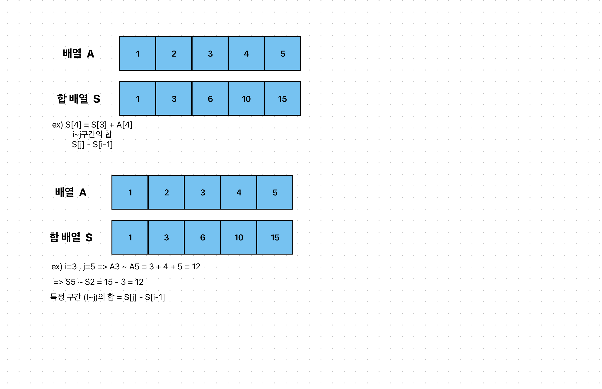
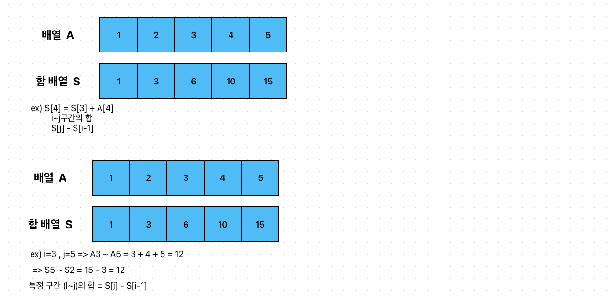

# 나머지 합
[link](https://www.acmicpc.net/problem/10986)
---


## 문제 풀이

1. (S[j] % M ) - (S[i-1] % M) = 0
2. S[j] % M = S[i-1] % M 해당 식 처럼 나머지 값이 같아지는 S[j] 와 S[i-1]을 구해야 한다. 
3. 추가적으로 S[j] , S[i-1]이 0이 되는 상황도 포함시켜야함.


해당 문제의 경우, 0 과 1로 나머지가 두가지의 경우로 발생한다. 
결과적으로 두개를 뽑아야하는 것은 똑같고 조합으로 풀어햡니다. 왜냐면 순열은 순서가 중요하지만, 조합은 순서가 중요하지 않다. 

A[i]C2 = cnt * (cnt-1) / 2가 나머지가 같은 인덱스 개수이다. 

# 코드
``````
package src.Week5.Baekjoon10986;

import java.io.IOException;
import java.util.Scanner;

public class Baekjoon10986 {


    static int N, M;
    static int[] arr, sArr;
    public static void main(String[] args) throws IOException {
        Scanner sc = new Scanner(System.in);

        int N = sc.nextInt();
        int M = sc.nextInt();

        long[] S = new long[N]; // 합배열
        long[] C = new long[M]; // 합배열%M을 동일하게 만들어주는 i, j를 담는 배열

        long answer = 0;

        S[0] = sc.nextInt();

        // 합배열 생성
        for(int i=1; i < N; i++){
            S[i] = S[i - 1] + sc.nextInt();
        }

        for(int i = 0; i < N; i++){
            int remainder = (int) (S[i] % M);
            if(remainder == 0) {
                answer++;
            }

            C[remainder]++;
        }

        for(int i=0;i<M;i++){
            long cnt = C[i];
            answer = answer + (cnt * (cnt -1 ) / 2);
        }

        System.out.println(answer);
    }

}


``````