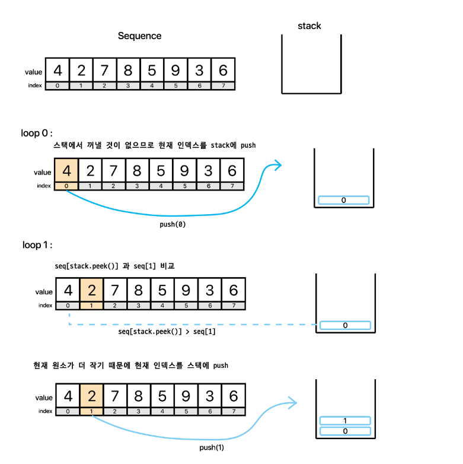
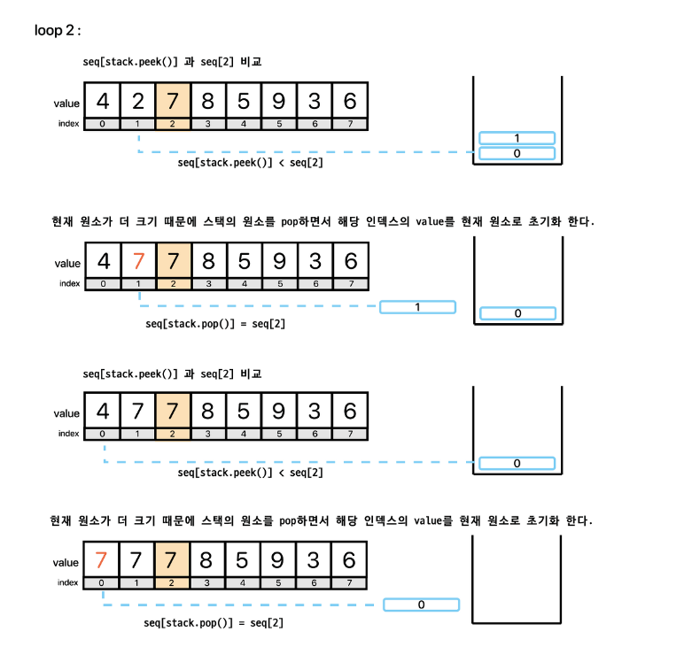
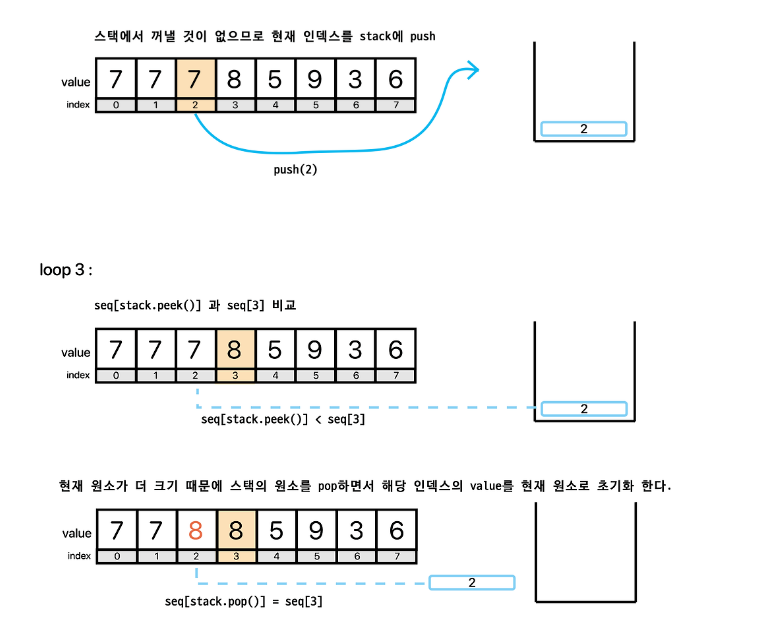
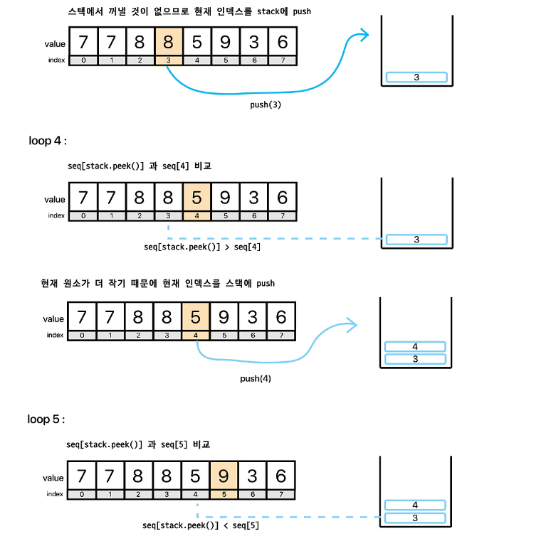
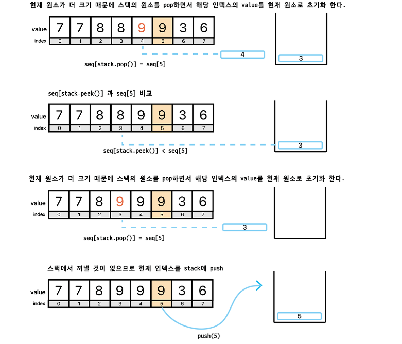
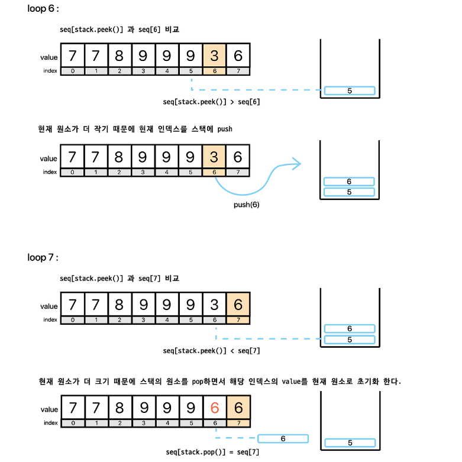
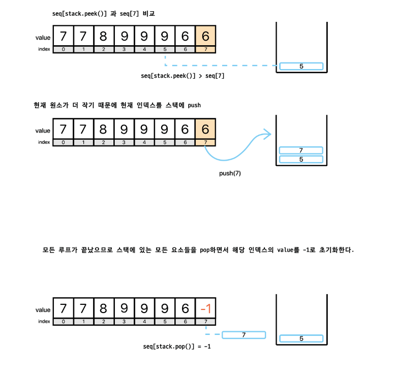
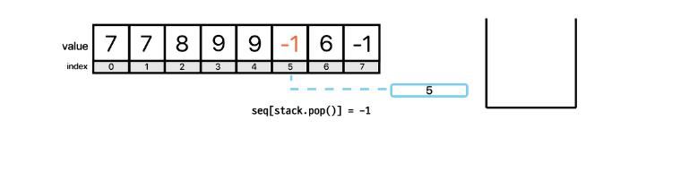

# 오큰수
[link](https://www.acmicpc.net/problem/17298)
---


## 문제 풀이

1. 해당 문제는 for문으로 풀다가 시간 초과가 나버려서.. 다시 문제를 풀었다.. 1,000,000 * 1,000,000 = 1조여서 시간초과가 난듯 싶다.
2. 어떻게 풀지 고민하다가... 다른 사람의 문제 풀이를 확인한 결과 스택으로 푸는 것을 보고 해당 방식으로 구현하였다. 
3. 스택은 후입 선출이다. 즉, 뒤에 들어온 값을 확인하여 크다면 바꿔 낄 수 있는 것이다. 
ex) {3, 5, 2, 7} 수열 
3 보다 큰 수 (5,7)중 가장 오른쪽에 있는 수는 5다.
5 보다 큰 수 (7)중 가장 오른쪽에 있는 수는 7이다.
2 보다 큰 수 (7)중 가장 오른쪽에 있는 수는 7이다.
7 보다 큰 수 (공집합)중 가장 오른쪽에 있는 수 존재하지 않으므로 -1이다.









# 코드
``````
package src.Week5.Baekjoon14888;

import java.io.BufferedReader;
import java.io.IOException;
import java.io.InputStreamReader;
import java.util.StringTokenizer;

public class Baekjoon14888 {
    static int MAX = Integer.MIN_VALUE;
    static int MIN = Integer.MAX_VALUE;
    static int N;
    static int[] operatorArr = new int[4];
    static int[] numArr;
    public static void main(String[] args) throws IOException {
        BufferedReader br = new BufferedReader(new InputStreamReader(System.in));

        N = Integer.parseInt(br.readLine());

        StringTokenizer st = new StringTokenizer(br.readLine());

        numArr = new int[N];
        int count = 0;
        while(st.hasMoreTokens()){
            numArr[count] = Integer.parseInt(st.nextToken());
            count++;
        }

        st = new StringTokenizer(br.readLine());
        count = 0;
        while(st.hasMoreTokens()){
            operatorArr[count] = Integer.parseInt(st.nextToken());
            count++;
        }

        solve(numArr[0],1);

        System.out.println(MAX);
        System.out.println(MIN);
    }

    public static void solve(int num, int count){
        if(count == N) {
            MIN = Math.min(MIN, num);
            MAX = Math.max(MAX, num);
            return;
        }

        for(int i=0; i< 4; i++){
            if(operatorArr[i]>0){
                operatorArr[i]--;
                switch(i) {
                    case 0: solve(num + numArr[count],  count+1); break;
                    case 1: solve(num - numArr[count], count+1); break;
                    case 2: solve(num * numArr[count], count+1); break;
                    case 3: solve(num / numArr[count],  count+1); break;
                }
                operatorArr[i]++;
            }
        }
    }
}

``````