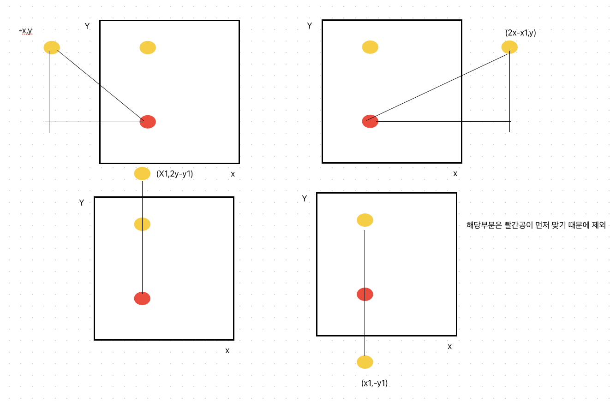

# 당구연습
[link](https://school.programmers.co.kr/learn/courses/30/lessons/169198)

## 문제 풀이 

1. 가장 먼저 수학적인 지식을 알고 있어야함 입사각과 반사각이 같으면 해당 거리는 일자로 길이를 대칭하여 이동하였을 경우 길이와 같다. 
2. 이것을 기준으로 상하좌우로 대칭시켜 가장 짧은 최소거리를 구하면 되는 문제이다. 


3. 그림과 같이 먼저 부딛힌 다면 빨간공이 해당 부분은 제외해주어야한다. 왜냐면 대칭이 되기전에 빨간공이 먼저 맞는 것은 말이 되지 않기 때문이다. 

````````
import java.util.*;

class Solution {
    
    static class Point {
        int x,y;
        public Point(int x, int y){
            this.x = x;
            this.y = y;
        }
    }
    
    public int[] solution(int m, int n, int startX, int startY, int[][] balls) {
        int[] answer = new int[balls.length];
        
        Point border = new Point(m, n);
        Point start = new Point(startX, startY);
        
        for(int i=0; i< balls.length; i++){
            int[] ball = balls[i];
            
            List<Point> transBall = symmetricTransposition(border, start, new Point(ball[0], ball[1]));
            
            int minDistance = Integer.MAX_VALUE;
            for(Point point : transBall) {
                minDistance = Math.min(calculationDistance(point, start), minDistance);
            }
            
            answer[i] = minDistance;
        }
        
        return answer;
    }
    
    private static List<Point> symmetricTransposition(Point bord, Point start, Point ball){
        List<Point> syms = new ArrayList<>();
        
        // 4개의 방향으로 대칭이동 
        // 선 대칭일 때, 벽보다 공에 먼저 맞는 경우 제외 
        // 아래 대칭이동
        if(!(start.x == ball.x && start.y > ball.y)) syms.add(new Point(ball.x, ball.y * -1));
        // 위로 대칭이동
        if(!(start.x == ball.x && start.y < ball.y)) syms.add(new Point(ball.x, 2 * bord.y - ball.y));
        // 우로 대칭이동
        if(!(start.y == ball.y && start.x < ball.x)) syms.add(new Point(2*bord.x - ball.x, ball.y));
        // 좌로 이동
        if(!(start.y == ball.y && start.x > ball.x)) syms.add(new Point(ball.x * -1, ball.y));
        
        return syms;
    
    }
    
    static int calculationDistance(Point point, Point start){
        return (int)(Math.pow(point.x - start.x, 2) + Math.pow(point.y - start.y, 2));
    }
}
````````