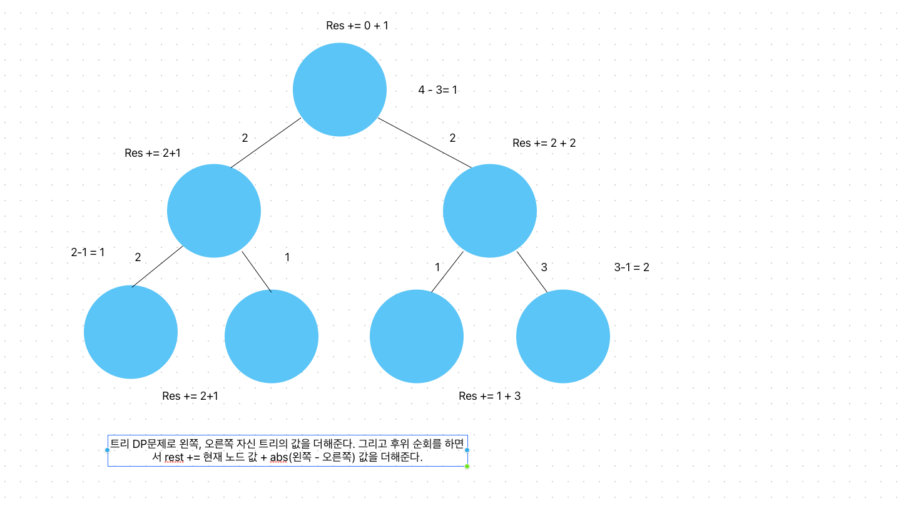

# 이진트리
[link](https://www.acmicpc.net/problem/13325)

## 문제 풀이

1. 어떤 엣지들의 가중치를 증가 시켜서 모든 엣지들의 거리를 같게함. 즉, 큰 수에서 작은 수를 뺀 절대값을 작은 수에다가 더해주면 모든 엣지들이 같아 질 수 있음. 

   


````````
package src.Week6.Baekjoon13325;

import java.io.BufferedReader;
import java.io.IOException;
import java.io.InputStreamReader;
import java.util.StringTokenizer;

public class Baekjoon13325 {
    static int n, k, res;
    static int[] arr, tree;
    public static void main(String[] args) throws IOException {
        BufferedReader br = new BufferedReader(new InputStreamReader(System.in));
        k = Integer.parseInt(br.readLine());

        n = (int)Math.pow(2, k+1) -1;
        arr = new int[n+1];
        StringTokenizer st = new StringTokenizer(br.readLine());
        for(int i=2; i<=n;i++){
            arr[i] = Integer.parseInt(st.nextToken());
        }

        dfs(1,0);
    }

    static int dfs(int idx, int h){
        if(h==k){
            res += arr[idx];
            return arr[idx];
        }

        int left = dfs(idx*2, h+1);
        int right = dfs(idx*2+1, h+1);
        res += arr[idx] + Math.abs(left - right);
        return arr[idx] + Math.max(left, right);
    }
}

````````