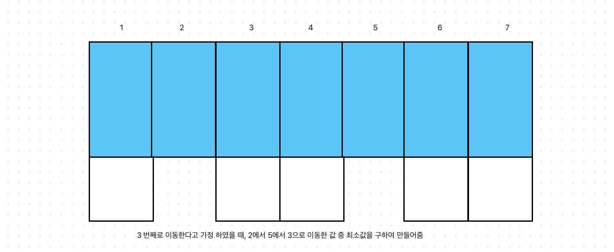
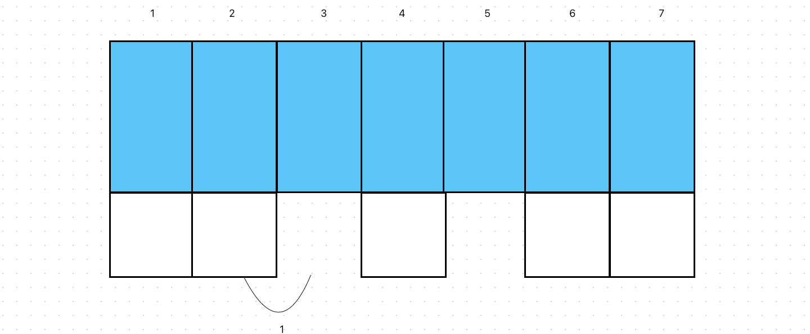
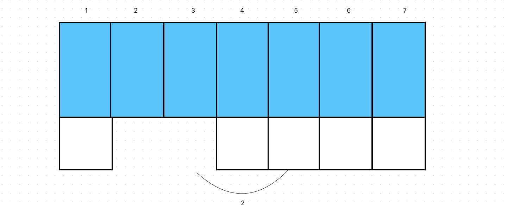

# 벽장문 이동
[link](https://www.acmicpc.net/problem/2666)

## 문제 풀이

   
   
   
````````
package src.Week6.Baekjoon2666;

import java.io.BufferedReader;
import java.io.IOException;
import java.io.InputStreamReader;
import java.util.StringTokenizer;

public class Baekjoon2666 {
    static int[] move;
    static int m;
    static int ans= Integer.MAX_VALUE;
    public static void main(String[] args) throws IOException {
        BufferedReader br = new BufferedReader(new InputStreamReader(System.in));

        int n  = Integer.parseInt(br.readLine());

        StringTokenizer st = new StringTokenizer(br.readLine()," ");

        int hasNoDoorOne = Integer.parseInt(st.nextToken());
        int hasNoDoorTwo = Integer.parseInt(st.nextToken());

        m = Integer.parseInt(br.readLine());
        move = new int[m];
        for(int i=0;i<m;i++){
            move[i] = Integer.parseInt(br.readLine());
        }

        answer(hasNoDoorOne,hasNoDoorTwo, 0,0);


        System.out.println(ans);
    }

    static void answer(int hasNoDoorOne, int hasNoDoorTwo, int level, int cnt){
        if(m==level) {
            ans = Math.min(ans, cnt);
            return ;
        }

        int DoorOneTrg =  Math.abs(hasNoDoorOne-move[level]);
        int DoorTwoTrg = Math.abs(hasNoDoorTwo-move[level]);

        answer(move[level], hasNoDoorTwo, level+1, cnt+DoorOneTrg);
        answer(hasNoDoorOne, move[level], level+1, cnt +DoorTwoTrg);

    }

}
````````