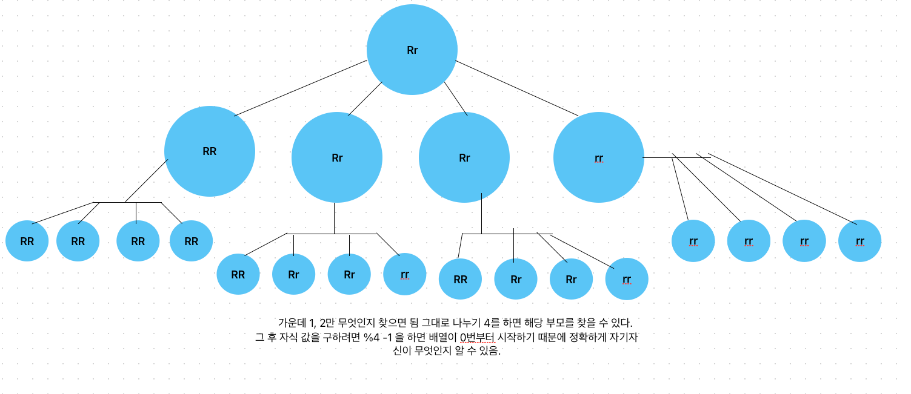

# 유전법칙 [pccp 모의고사 1]
[link](https://school.programmers.co.kr/learn/courses/15008/lessons/121685)

## 문제 풀이

   


````````
package src.Week6.ProgrammersBean;

public class Bean {
    static String[] popList = {"RR", "Rr", "Rr", "rr"};
    public static void main(String[] args) {
        int [][] problems = {{3,5},{3,8}};

        for(String str : solution(problems)){
            System.out.println("str = " + str);
        }
    }
    static String[] solution(int[][] queries){
        String[] answer = new String[queries.length];

        for(int i=0;i< queries.length; i++){
            int gen = queries[i][0];
            int num = queries[i][1];

            answer[i] = recursive(gen, num);

        }

        return answer;
    }

    static String recursive(int gen, int num){
        String target = popList[1];
        switch(gen){
            case 1: return target;
            case 2:
                target = popList[num-1];
                return target;
            default:

                gen = gen -1;
                int parentNum = (int)Math.ceil((double)num / (double)4);
                int parentsChildNum = num%4 -1;
                target = recursive(gen, parentNum);

                if(target.equals(popList[0]) || target.equals(popList[3])){
                    return target;
                }

                target = popList[parentsChildNum%4==-1? 3 : parentsChildNum];
                return target;
        }


    }
}

````````