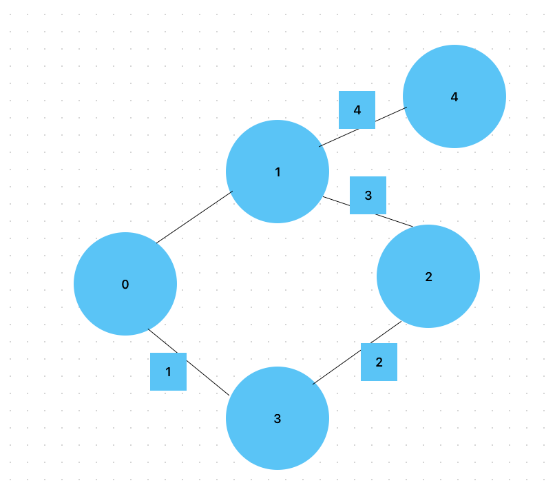

# ABCDE (13023)




# 문제 풀이
1. 각각의 친구는 연결되어 있지 않다. 즉, Depth가 레벨별로 내려가면서 간선의 길이가 예제처럼 4개여야 한다. 그렇다면 "YES" 아니라면 "NO"를 출력하자.
2. 똑같은 곳을 방문 할 수 없기 떄문에 방문 체크를 해야한다. 
3. 최대 Depth 5를 만족하지 못하고 다시 재귀를 호출하게 만들어야함 그래서 재귀시 맨마지막에 방문 체크를 해제시켜주는 v[i] = false 로직을 추가해주어야함.

``````
package src.week3.Baekjoon13023;

import java.io.*;
import java.util.ArrayList;
import java.util.List;
import java.util.Scanner;
import java.util.StringTokenizer;

public class Baekjoon13023 {
    private static int m;
    private static List<Integer>[] list;
    private static int ans = 0;
    private static boolean[] v;

    public static void main(String[] args) throws IOException {
        BufferedReader br = new BufferedReader(new InputStreamReader(System.in));
        BufferedWriter bw = new BufferedWriter(new OutputStreamWriter(System.out));
        StringTokenizer st = new StringTokenizer(br.readLine());

        int N = Integer.parseInt(st.nextToken());
        int M = Integer.parseInt(st.nextToken());

        list = new ArrayList[N];
        v = new boolean[N];
        for(int i = 0; i< N; i++){
            list[i] = new ArrayList<Integer>();
        }

        for(int i = 0; i < M; i++){
            st = new StringTokenizer(br.readLine());
            int n1 = Integer.parseInt(st.nextToken());
            int n2 = Integer.parseInt(st.nextToken());
            list[n1].add(n2);
            list[n2].add(n1);
        }

        for(int i = 0; i < N; i++){
            if(ans == 0) dfs(i,1);
        }

        bw.write(Integer.toString(ans));
        bw.flush();
        bw.close();
        br.close();
    }
    public static void dfs(int start, int depth){
        if(depth == 5) {
            ans = 1;
            return ;
        }
        v[start] = true;
        for(int i : list[start]) {
            int next = i;
            if(!v[next]){
                dfs(next, depth+1);
            }
        }
        v[start] = false;
    }
}

``````