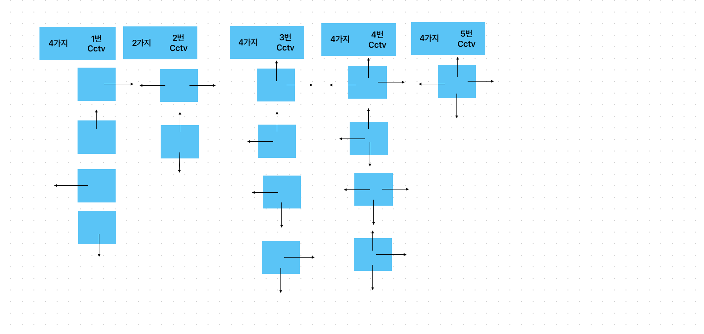

# 감시 (15683)




# 문제 풀이
1. 예시) 1번과 3번을 가진 CCTV를 가진 사무실이 있으면 4가지 x 4가지의 방향 가지수로 16가지라는 경우의 수가 나온다. 이런 경우 2번과 5번은 방향의 가지수가 있으며 각각의 CCTV는 방향이 다르기 때문에 순서가 중요하여 순열로 구해야 한다. 
2. 순열이란 n개의 값중에서 r개의 숫자를 순서대로 뽑는 경우를 말한다. 
3. 각각의 CCTV는 각각의 다른 방향이 있으며 각각의 cctv의 위치와 몇번 cctv인지 판단할 필드값을 가지는 클래스를 하나 만들어준다. 
4. 순열을 담아줄 배열을 하나 만들어주어 output을 cctv개수만큼 담을 배열을 선언해준다. 
5. 순열 함수를 만들어 주어, 각각의 경우의 수에 대한 copymap을 구해준다. 여기서 copymap을 해주는 이유는 방향에따른 맵을 그려주었을 때, 다시 다른 경우의 수에 대한 맵을 처음부터 그려주기 위하여 copyMap을 선언한다. 
6. 그 후 cctvList에 있는 cctv를 하나씩 조회하여 방향을 구해준 후, 각각의 총 4가지에 대한 방향을 for문으로 돌려주어 담아준다음에 depth와 순열에 있는 크기가 비슷해졌을 경우 사각지대를 구해준다. 
- - -
``````
package src.week3.Baekjoon15683;

import java.io.BufferedReader;
import java.io.IOException;
import java.io.InputStreamReader;
import java.util.*;

public class Baekjoon15683 {
    static int N, M;
    static int map[][];
    static int copyMap[][];
    static int output[];
    static ArrayList<CCTV> cctvList;
    static int dx[] = {-1, 0, 1, 0};
    static int dy[] = {0, 1, 0, -1};
    static int answer = Integer.MAX_VALUE;
    public static void main(String[] args) throws IOException {
        Scanner sc = new Scanner(System.in);
        N = sc.nextInt();
        M = sc.nextInt();
        map = new int[N][M];
        cctvList = new ArrayList<>();

        for(int i = 0; i < N; i++) {
            for(int j = 0; j < M; j++) {
                map[i][j] = sc.nextInt();

                if(map[i][j] != 0 &&  map[i][j] != 6) {
                    cctvList.add(new CCTV(map[i][j], i, j));
                }
            }
        }

        output = new int[cctvList.size()]; // 순열을 담을 배열
        permutation(0, cctvList.size());

        System.out.println(answer);
    }
    public static void permutation(int depth, int r){
        if(depth == r) {
            // Copy original 'map' array
            copyMap = new int[N][M];
            for(int i = 0; i < map.length; i++) {
                System.arraycopy(map[i], 0, copyMap[i], 0, map[i].length);
            }

            // cctv번호와 순열로 뽑혀진 방향에 맞는 상하좌우 방향 설정
            for(int i = 0; i < cctvList.size(); i++) {
                direction(cctvList.get(i), output[i]);
            }

            // 사각 지대 구하기
            getBlindSpot();

            return;
        }

        for(int i = 0; i < 4; i++) {
            output[depth] = i;
            permutation(depth+1, r);
        }
    }

    public static void direction(CCTV cctv, int d){
        int cctvNum = cctv.num;

        if(cctvNum == 1) {
            if(d == 0) watch(cctv, 0); // 상
            else if(d == 1) watch(cctv, 1); // 우
            else if(d == 2) watch(cctv, 2); // 하
            else if(d == 3) watch(cctv, 3); // 좌
        } else if(cctvNum == 2) {
            if(d == 0 || d == 2) {
                watch(cctv, 0); watch(cctv, 2); // 상하
            } else {
                watch(cctv, 1); watch(cctv, 3); // 좌우
            }
        } else if(cctvNum == 3) {
            if(d == 0) {
                watch(cctv, 0); // 상우
                watch(cctv, 1);
            } else if(d == 1) {
                watch(cctv, 1); // 우하
                watch(cctv, 2);
            } else if(d == 2) {
                watch(cctv, 2); // 하좌
                watch(cctv, 3);
            } else if(d == 3) {
                watch(cctv, 0); // 좌상
                watch(cctv, 3);
            }
        } else if(cctvNum == 4) {
            if(d == 0) {
                watch(cctv, 0); // 좌상우
                watch(cctv, 1);
                watch(cctv, 3);
            } else if(d == 1) {
                watch(cctv, 0); // 상우하
                watch(cctv, 1);
                watch(cctv, 2);
            } else if(d == 2) {
                watch(cctv, 1); // 좌하우
                watch(cctv, 2);
                watch(cctv, 3);
            } else if(d == 3) {
                watch(cctv, 0); // 상좌하
                watch(cctv, 2);
                watch(cctv, 3);
            }
        } else if(cctvNum == 5) { // 상우하좌
            watch(cctv, 0);
            watch(cctv, 1);
            watch(cctv, 2);
            watch(cctv, 3);
        }
    }

    public static void watch(CCTV cctv, int d){
        Queue<CCTV> queue = new LinkedList<>();
        boolean[][] visited = new boolean[N][M];

        queue.add(cctv);
        visited[cctv.x][cctv.y] = true;

        while(!queue.isEmpty()) {
            int nx = queue.peek().x + dx[d];
            int ny = queue.poll().y + dy[d];

            // 범위를 벗어나거나 벽을 만나면 끝
            if(nx < 0 || nx >= N || ny < 0 || ny >= M || copyMap[nx][ny] == 6) {
                break;
            }

            if(copyMap[nx][ny] == 0) {
                copyMap[nx][ny] = -1; // 빈칸이라면 감시할 수 있다는 의미로 -1
                queue.add(new CCTV(cctv.num, nx, ny));
            } else { // 다른 cctv가 있거나 이미 감시된 칸이라면
                queue.add(new CCTV(cctv.num, nx, ny)); // 그냥 통과
            }
        }
    }

    // 사각 지대 구하기
    public static void getBlindSpot() {
        int cnt = 0;
        for(int i = 0; i < N; i++) {
            for(int j = 0; j < M; j++) {
                if(copyMap[i][j] == 0) {
                    cnt++;
                }
            }
        }
        answer = Math.min(answer, cnt);
    }
    static class CCTV{
        int num;
        int y;
        int x;
        CCTV(int num,  int x, int y){
            this.num = num;
            this.y = y;
            this.x = x;
        }
    }
}

````` 