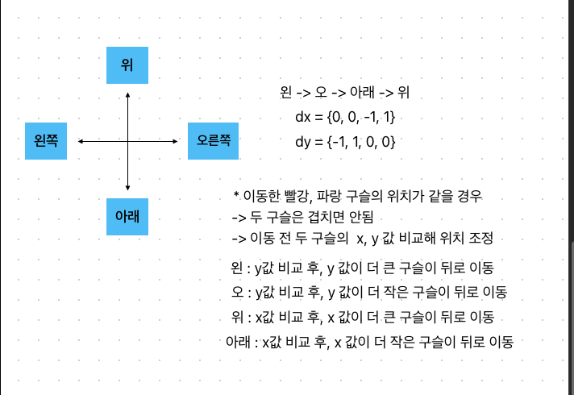

# 구슬치기2 (13460)



# 문제 풀이
1. 구슬이 한 방향으로 쭉 이동합니다. '#' 이있으면 벽에 부딛친다. (왼 오 아래 위)
2. 한번 방문한 곳은 다시 방문하지 않도록 방문 체크한다.
3. 구멍을 만나면 방문횟수를 return 한다.

``````
package src.week4.Baekjoon13460;

import java.io.BufferedReader;
import java.io.IOException;
import java.io.InputStreamReader;
import java.util.LinkedList;
import java.util.Queue;
import java.util.StringTokenizer;

public class Baekjoon13460 {
    static int N,M;
    static boolean [][][][]visited;
    static char [][]board;
    static int holeX,holeY;
    static Marble red,blue;
    static int dx[] = {0, 0, -1, 1}; // 왼 오 아래 위
    static int dy[] = {-1, 1, 0, 0};
    static class Marble{
        int rx;
        int ry;
        int bx;
        int by;
        int cnt;
        Marble(int rx, int ry, int bx, int by, int cnt){
            this.rx = rx;
            this.ry = ry;
            this.bx = bx;
            this.by = by;
            this.cnt = cnt;
        }
    }
    public static void main(String[] args) throws IOException {
        BufferedReader br = new BufferedReader(new InputStreamReader(System.in));
        StringTokenizer st = new StringTokenizer(br.readLine());
        N = Integer.parseInt(st.nextToken());
        M = Integer.parseInt(st.nextToken());
        board = new char[N][M];
        visited = new boolean[N][M][N][M];

        for(int i=0; i<N; i++){
            String str = br.readLine();
            for(int j=0; j<M; j++){
                board[i][j] = str.charAt(j);

                if(board[i][j]=='R'){
                    red = new Marble(i, j, 0,0,0);
                } else if(board[i][j] == 'B'){
                    blue = new Marble(0, 0, i, j, 0);
                } else if(board[i][j] =='O'){
                    holeX = i;
                    holeY = j;
                }
            }
        }

        System.out.println(bfs());
    }

    static int bfs(){
        Queue<Marble> q = new LinkedList<>();
        q.add(new Marble(red.rx, red.ry, blue.bx, blue.by, 1));
        visited[red.rx][red.ry][blue.rx][blue.ry] = true;

        while(!q.isEmpty()){
            Marble marble = q.poll();
            int curRx = marble.rx;
            int curRy = marble.ry;
            int curBx = marble.bx;
            int curBy = marble.by;
            int curCnt = marble.cnt;

            if(curCnt > 10) {
                return -1;
            }

            for(int i=0; i<4; i++){
                int newRx = curRx;
                int newRy = curRy;
                int newBx = curBx;
                int newBy = curBy;

                boolean isRedHole = false;
                boolean isBlueHole = false;

                while (board[newRx + dx[i]][newRy + dy[i]] != '#' && newRx + dx[i] < N && newRx + dx[i] >= 0 && newRy + dy[i] < M && newRy + dy[i] >= 0){
                    newRx += dx[i];
                    newRy += dy[i];
                    if(holeX == newRx && holeY == newRy){
                        isRedHole = true;
                        break;
                    }
                }

                while(board[newBx + dx[i]][newBy + dy[i]] != '#' && newBx + dx[i] < N && newRx + dx[i] >= 0 && newRy + dy[i] < M && newRy + dy[i] >= 0){
                    newBx += dx[i];
                    newBy += dy[i];
                    if(holeX == newBx && holeY == newBy){
                        isBlueHole = true;
                        break;
                    }
                }

                if(isBlueHole){
                    continue;
                }

                if(isRedHole && !isBlueHole){
                    return curCnt;
                }

                if(newRx == newBx && newRy == newBy){
                    if(i==0){
                        if(curRy < curBy) newBy -= dy[i];
                        else newRy -= dy[i];
                    } else if(i==1){
                        if(curRy > curBy) newBy -= dy[i];
                        else newRy -= dy[i];
                    } else if(i==2){
                        if(curRx < curBx) newBx -= dx[i];
                        else newRx -= dx[i];
                    } else{
                        if(curRx > curBx) newBx -= dx[i];
                        else newRx -= dx[i];
                    }
                }

                if(!visited[newRx][newRy][newBx][newBy]){
                    q.add(new Marble(newRx, newRy, newBx, newBy, curCnt + 1));
                    visited[newRx][newRy][newBx][newBy] = true;
                }
            }
        }
        return -1;
    }
}
`````