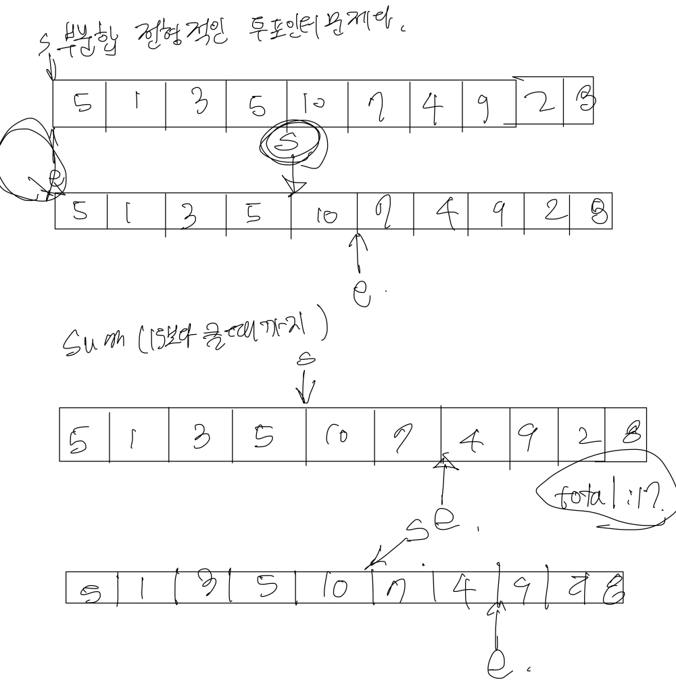

# 부분합
[link](https://www.acmicpc.net/problem/1806)

## 문제 풀이

1. 투포인트 알고리즘 문제
2. for문을 통해서 더해주는 것이 아닌 while문을 통해서 two pointer 인덱스를 가르킬 변수 두개를 정해주어, outOfCheck만 해주어 풀어줌. 
3. 더한 값에 answer 크면 해당 부분에서  
````````
package src.week9.baekjoon1806;

import java.io.BufferedReader;
import java.io.IOException;
import java.io.InputStreamReader;
import java.util.StringTokenizer;

public class baekjoon1806 {
    public static void main(String[] args) throws IOException {
        BufferedReader br = new BufferedReader(new InputStreamReader(System.in));
        StringTokenizer st = new StringTokenizer(br.readLine());

        int n = Integer.parseInt(st.nextToken());
        int answer = Integer.parseInt(st.nextToken());

        int min = Integer.MAX_VALUE;
        int []numbers = new int[n+1];

        st = new StringTokenizer(br.readLine());
        int count =0;
        while(st.hasMoreTokens()){
            numbers[count++] = Integer.parseInt(st.nextToken());
        }

        int start = 0;
        int end = 0;
        int total = 0;

        while(start <= n && end <= n){
            if(total >= answer && min > end - start ) min = end -start;
            if(total < answer) total += numbers[end++];
            else total -= numbers[start++];
        }

        if(min == Integer.MAX_VALUE) System.out.println("0");
        else System.out.println(min);

    }
}

````````