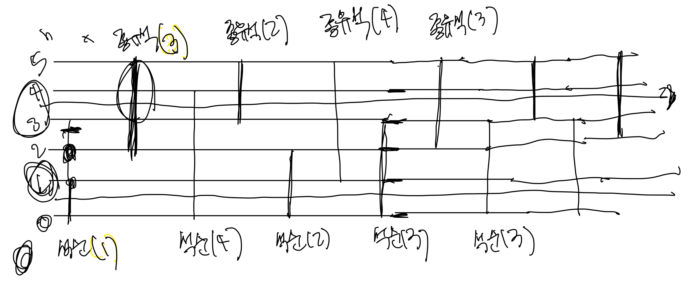

# 개똥벌레
[link](https://www.acmicpc.net/problem/3020)

## 문제 풀이 
결국 보고 풀었다..ㅠ 

1. 첫 번째 석순, 두 번째 종유석 
2. 석순은 밑에서 종유석은 위에서 즉, 거꾸로 세어주어야함..! 어떻게? 
3. 최소값을 구해주어야함.
4. 맨 밑에가 뿌셔진다면 나머지 값들도 다 뿌셔지는 컨셉 즉, 1이 뿌셔지면 나머지꺼도 다 뿌셔짐, 단 종유석은 반대로 생각해야함..! 
5. 문제를 풀 수 있는 방법은 이분 탐색, 누적 합으로 풀이 할 수 있다. 


````````
package src.week9.baekjoon3020;

import java.io.BufferedReader;
import java.io.IOException;
import java.io.InputStreamReader;
import java.util.Arrays;
import java.util.HashMap;
import java.util.Map;
import java.util.StringTokenizer;

public class Baekjoon3020 {
    static int N,H;
    static int min, count;
    Map<Integer, Integer> map = new HashMap<>();
    public static void main(String[] args) throws IOException {
        BufferedReader br = new BufferedReader(new InputStreamReader(System.in));
        StringTokenizer st = new StringTokenizer(br.readLine());

        N = Integer.parseInt(st.nextToken());
        H = Integer.parseInt(st.nextToken());
        int []down = new int[N/2]; // down
        int []up = new int[N/2]; // up 두개의 값을 분리하여 생각해야 하기 때문에 편리하게 두 배열을 선언해주었다.

        for(int i=0; i<N/2; i++){
            int num1 = Integer.parseInt(br.readLine());
            int num2 = Integer.parseInt(br.readLine());

            down[i] = num1;
            up[i] = num2;
        }

        Arrays.sort(up);
        Arrays.sort(down); // 이진탐색으로 구하려면 정렬이 되어 있어야 구할 수 있음.

        int min = N;
        int cnt = 0;
        for(int i=1; i<H+1; i++){
            int conflict = binarySearch(0,N/2, i, down) + binarySearch(0, N/2, H-i+1, up); // 거꾸로 뒤집어서 생각해야함 즉, H-i+1로 구해줄 수 있음.
            if(min==conflict) {
                cnt++;
                continue;
            }

            if(min>conflict) {
                cnt=1;
                min = conflict;
            }
        }


        System.out.println(min+ " " +cnt);
    }

    static int binarySearch(int left, int right, int h, int []arr){
        while(left<right){
            int mid = (left + right) / 2;

            if(arr[mid] >= h) {
                right = mid; // 정렬로 작은 순 부터 나열되기 때문에 h보다 mid에 있는 값이 크다면 위에 있는 값들은 전부 파괴 됨 그래서 right를 줄여줌
            } else {
                left = mid+1;
            }
        }

        return arr.length - right; // right값이 클 수록 파괴된 것이 없는 것 
    }


}

````````


부분합 -> 위에 매커니즘을 통해서 더해주어 구한다.


```
package src.week9.baekjoon3020;

import java.io.BufferedReader;
import java.io.IOException;
import java.io.InputStreamReader;
import java.util.StringTokenizer;

public class OthBaekjoon3020 {
    public static void main(String[] args) throws IOException {
        BufferedReader br = new BufferedReader(new InputStreamReader(System.in));
        StringTokenizer st = new StringTokenizer(br.readLine());

        int n = Integer.parseInt(st.nextToken());
        int h = Integer.parseInt(st.nextToken());
        int []down = new int[n/2+2];
        int []up = new int[n/2+2];

        for(int i=1; i<n/2; i++){
            int num1 = Integer.parseInt(br.readLine());
            int num2 = Integer.parseInt(br.readLine());

            down[num1]++;
            up[num2]++;
        }

        for(int i=1; i<h; i++){
            down[i] += down[i-1];
        }

        for(int i=h; i>=1; i--){
            up[i] += up[i+1];
        }

        int min = n;
        int cnt =0;
        for(int i=1;i<h+1; i++){
            int dif = (down[h]-down[i-1]) + (up[1]-up[i+1]);

            if(dif<min) {
                min = dif;
                cnt = 1;
            } else if(dif==min) cnt++;
        }

        System.out.println(min+ " " +cnt);
    }
}

```