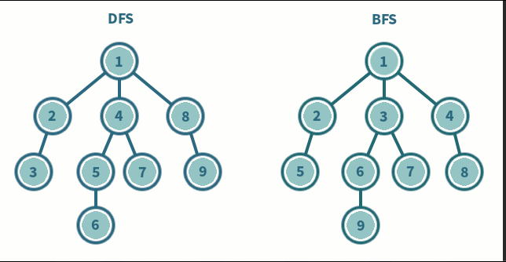

# Baekjoon Algorithm 1260 DFS와 BFS
## 문제 
- - - 
그래프를 DFS로 탐색한 결과와 BFS로 탐색한 결과를 출력하는 프로그램을 작성하시오. 
단, 방문할 수 있는 정점이 여러 개인 경우에는 정점 번호가 작은 것을 먼저 방문하고, 더 이상 방문할 수 있는 점이 없는 경우 종료한다. 정점 번호는 1번부터 N번까지이다.

## DFS , BFS 개념 정리 
- - -
## 1. DFS vs BFS 비교
- - -



깊이우선탐색(Depth First Search)
- 한 노드의 자식을 끝까지 순회한 후 다른 노드 순회
- 자식 우선
- 스택(LIFO) 사용 => 재귀함수가 스택구조임

너비우선탐색(Breadth First Search)
- 한 단계씩 내려가면서 같은 레벨에 있는 노드들을 먼저 순회
- 형제 우선
- 큐(FIFO) 사용

## 2. DFS(깊이 우선 탐색, Depth-First Search)
- - -
### 특징 
- 자기 자신을 호출하는 순환 알고리즘의 형태를 지닙니다.(재귀 or 스택)
- 그래프 탐색의 경우 어떤 노드를 방문했었는지 여부를 반드시 검사해야함 
- 미로를 탐색할 때, 해당 분기에서 갈 수 있을 때까지 계속 가다가 더 이상 갈 수 없게 되면 다시 가장 가까운 갈림길로(새로운 분기)로 돌아와서 다른 방향으로 다시 탐색을 진행하는 방법
- 모든 노드를 방문하고자 할 때, 이 방법을 선택
- 너비우선탐색(BFS)보다 간단하다.
- 검색 속도 자체는 너비우선탐색보다는 느리다. 
### 샘플 코드
``````
public static void dfs(int i) {
    visited[i] = true;
    
    for(int j=1; j<n+1; j++) {
        if(map[i][j] == 1 && visited[i] == false) {
            dfs(j);
        }
    }
}   
``````

## 3. BFS(너비 우선 탐색)
- - -
### 특징
- BFS는 재귀적으로 동작하지 않는다.
- 그래프 탐색의 경우 어떤 노드를 방문했었는지 여부를 반드시 검사해야한다 (검사하지 않을 경우 무한루프에 빠질 수 있다.)
- BFS는 방문한 노드들을 차례로 저장한 후 꺼낼 수 있는 자료 구조인 큐를 사용합니다. 
- 즉, 선입선출 원칙으로 탐색한다.
- 시작 정점으로부터 가까운 정점을 먼저 방문하고 멀리 떨어져 있는 정점을 나중에 방문하는 순회 방법이다. 
- 두 노드 사이의 최단 경로 혹은 임의의 경로를 찾고 싶을 떄 이 방법을 사용한다. 

``````
public static void bfs(int i) {
    Queue<Integer> q = new LinkedList<>();
    q.offer(i);
    visit[i] = true;
    
    while(!q.isEmpty()) {
        int temp = q.poll();
        for(int j=1; j<=n; j++) {
            if(map[temp][j] == 1 && visit[j] == false) {
                q.offer(j);
                visit[j] = true;
            }
        }
    }
}
``````
## 문제 풀이 
1. 주어진 정점 , 간선의 개수, 시작할 정점의 번호를 가지고 DFS, BFS를 구현한다. 

## 내가 작성한 코드 
``````
package Week1.Baekjoon1260;

import java.io.BufferedReader;
import java.io.IOException;
import java.io.InputStreamReader;
import java.util.*;

/** DFS와 BFS
 *  그래프를 DFS로 탐색한 결과와 BFS 탐색한 결과를 출력하는 프로그램을 작성하시오.
 *  단, 방문할 수 있는 정점이 여러 개인 경우에는 정점 번호가 작은 것을 먼저 방문하고 더 이상 방문할 수 있는 점이 없는 경우 종료한다. 정점 번호는 1번부터 N번까지이다.
 */
public class Baekjoon1260 {
    static int n; // 정점 개수
    static int m; // 간선 개수
    static int start; // 시작
    static int [][]graph; // 그래프
    static boolean []visited; // 방문한 장소
    static int count; // count
    static Queue<Integer> queue = new LinkedList<>(); // bfs를 위한 queue
    public static void main(String[] args) throws IOException {
        BufferedReader br = new BufferedReader(new InputStreamReader(System.in));
        String str = br.readLine();
        StringTokenizer st = new StringTokenizer(str);
        n = Integer.parseInt(st.nextToken());
        m = Integer.parseInt(st.nextToken());
        start = Integer.valueOf(st.nextToken());

        graph= new int[n+1][n+1]; // n + 1 정점의 개수 0번부터 시작하기때문에 +1 을 더해줌
        visited = new boolean[n+1];

        for(int i=0;i<m;i++){
            st = new StringTokenizer(br.readLine());
            int n = Integer.parseInt(st.nextToken());
            int v = Integer.parseInt(st.nextToken());
            graph[n][v]= graph[v][n] = 1; // 양방향이기 때문에 둘 다 1
        }

        dfs(start);
        System.out.println();
        visited = new boolean[n+1];
        bfs();
    }
    public static void dfs(int start){
        visited[start] = true;
        System.out.print(start + " ");
        if(count == n) { // count 와 n 간선의 개수가 똑같으면 리턴
            return;
        }
        count++;
        for(int i=1;i<=n;i++){
            if(graph[start][i]==1 && visited[i]== false){
                dfs(i);
            }
        }
    }

    public static void bfs(){
        queue.add(start);
        visited[start] = true;
        System.out.print(start+ " "); // bfs 출력해주는 부분 
        while(!queue.isEmpty()){
            start = queue.poll();
            for(int i=1;i<=n;i++){
                if(graph[start][i]==1 && visited[i]==false){
                    queue.offer(i);
                    visited[i]=true;
                    System.out.print(i+ " "); // bfs출력해주는 부분
                }
            }
        }
    }
}
``````